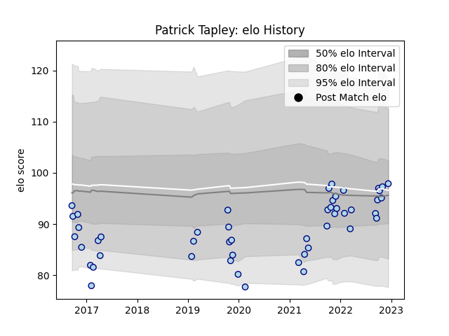

---  
layout: page  
title: Patrick Tapley  
date: 2023-02-02 15:50:23.802653  
categories: player  
---
# Patrick Tapley

## Positions: W

## Current elo: 94.0

## Current Percentile: 21.0

# Elo History

# Match History

| Team    |   Appearances |   Win Rate |
|:--------|--------------:|-----------:|
| Bedford |            57 |   0.307018 |

| Opponent            |   Matches |   Win Rate |
|:--------------------|----------:|-----------:|
| Coventry            |         7 |   0.285714 |
| Doncaster           |         7 |   0.142857 |
| Ealing Trailfinders |         7 |   0        |
| Richmond            |         5 |   0.2      |
| Cornish Pirates     |         4 |   0.375    |
| London Scottish     |         4 |   0.75     |
| Nottingham          |         4 |   0.5      |
| Ampthill            |         3 |   0.333333 |
| Hartpury College    |         3 |   0.666667 |
| Jersey              |         3 |   0        |
| Caldy               |         2 |   0.5      |
| London Irish        |         2 |   0        |
| Rotherham Titans    |         2 |   1        |
| Yorkshire Carnegie  |         2 |   0.5      |
| Newcastle Falcons   |         1 |   0        |
| Saracens            |         1 |   0        |