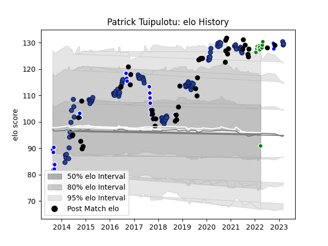

---  
layout: page  
title: Patrick Tuipulotu  
date: 2023-03-20 15:47:03.055082  
categories: player  
---
# Patrick Tuipulotu

Last updated: 2023-03-20
## Positions: L

## Country: New Zealand

## Current elo: 91.0

## Current Percentile: 95.0

# Elo History

# Match History

| Team            |   Appearances |   Win Rate |
|:----------------|--------------:|-----------:|
| Blues           |            92 |   0.472826 |
| New Zealand     |            45 |   0.811111 |
| Auckland        |            24 |   0.541667 |
| Toyota Verblitz |            11 |   0.636364 |

| Opponent                          |   Matches |   Win Rate |
|:----------------------------------|----------:|-----------:|
| Hurricanes                        |        13 |   0.384615 |
| Highlanders                       |        13 |   0.538462 |
| Chiefs                            |        13 |   0.269231 |
| Crusaders                         |        10 |   0.1      |
| Australia                         |         9 |   0.722222 |
| Argentina                         |         7 |   0.857143 |
| South Africa                      |         7 |   0.714286 |
| New South Wales Waratahs          |         7 |   0.857143 |
| Wales                             |         5 |   1        |
| Stormers                          |         5 |   0.4      |
| Brumbies                          |         5 |   0.6      |
| Counties Manukau                  |         4 |   0.25     |
| Western Force                     |         4 |   1        |
| Waikato                           |         4 |   0.25     |
| Bulls                             |         4 |   0.625    |
| Queensland Reds                   |         4 |   0.875    |
| North Harbour                     |         4 |   0.75     |
| Lions                             |         4 |   0.25     |
| England                           |         4 |   0.75     |
| Sharks                            |         3 |   0        |
| Taranaki                          |         3 |   0.333333 |
| Tonga                             |         2 |   1        |
| Northland                         |         2 |   1        |
| Black Rams Tokyo                  |         2 |   1        |
| Italy                             |         2 |   1        |
| Japan                             |         2 |   1        |
| Jaguares                          |         2 |   0.5      |
| Southland                         |         2 |   1        |
| Ireland                           |         2 |   0        |
| Cheetahs                          |         2 |   0.5      |
| Tokyo Sungoliath                  |         1 |   0        |
| United States of America          |         1 |   1        |
| Tasman                            |         1 |   1        |
| Wellington                        |         1 |   0        |
| Urayasu D-Rocks                   |         1 |   1        |
| Sunwolves                         |         1 |   1        |
| Toshiba Brave Lupus Tokyo         |         1 |   1        |
| Namibia                           |         1 |   1        |
| Southern Kings                    |         1 |   1        |
| Shizuoka Blue Revs                |         1 |   1        |
| Saitama Wild Knights              |         1 |   0        |
| Otago                             |         1 |   0        |
| NTT Docomo Red Hurricanes Osaka   |         1 |   1        |
| Melbourne Rebels                  |         1 |   1        |
| Manawatu                          |         1 |   1        |
| Kubota Spears Funabashi Tokyo-Bay |         1 |   0        |
| Green Rockets Tokatsu             |         1 |   1        |
| France                            |         1 |   1        |
| Fiji                              |         1 |   1        |
| Canada                            |         1 |   1        |
| Bay of Plenty                     |         1 |   1        |
| Yokohama Canon Eagles             |         1 |   0        |