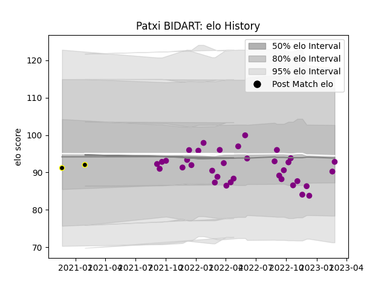

---  
layout: page  
title: Patxi BIDART  
date: 2023-03-06 11:23:10.057367  
categories: player  
---
# Patxi BIDART

## Positions: H

## Current elo: 93.0

## Current Percentile: 34.0

# Elo History

# Match History

| Team             |   Appearances |   Win Rate |
|:-----------------|--------------:|-----------:|
| Soyaux-Angouleme |            35 |   0.571429 |
| Mont-de-Marsan   |             2 |   0        |

| Opponent                   |   Matches |   Win Rate |
|:---------------------------|----------:|-----------:|
| Massy                      |         3 |   0.333333 |
| Nevers                     |         2 |   0        |
| Aubenas                    |         2 |   1        |
| Aurillac                   |         2 |   0        |
| Valence Romans Drome Rugby |         2 |   0.5      |
| Tarbes                     |         2 |   0.5      |
| Blagnac                    |         2 |   1        |
| Bourgoin-Jallieu           |         2 |   1        |
| Carcassonne                |         2 |   1        |
| Albi                       |         2 |   1        |
| Agen                       |         1 |   1        |
| Suresnes                   |         1 |   1        |
| Rouen                      |         1 |   0        |
| Provence Rugby             |         1 |   0        |
| Oyonnax                    |         1 |   0        |
| Nice                       |         1 |   1        |
| Grenoble                   |         1 |   0        |
| Montauban                  |         1 |   1        |
| Mont-de-Marsan             |         1 |   0        |
| Dijon                      |         1 |   0        |
| Dax                        |         1 |   0        |
| Cognac Saint Jean d'Angély |         1 |   1        |
| Chambery                   |         1 |   0        |
| Biarritz Olympique         |         1 |   0        |
| Beziers                    |         1 |   1        |
| Vannes                     |         1 |   1        |