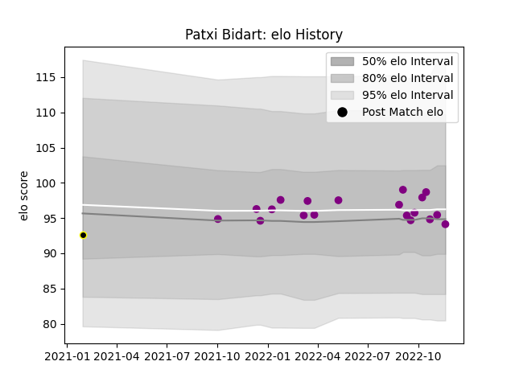

---  
layout: page  
title: Patxi Bidart  
date: 2022-12-09 13:10:59.220726  
categories: player  
---
# Patxi Bidart

## Positions: H

## Current elo: 95.0

## Current Percentile: 46.0

# Elo History

# Match History

| Team             |   Appearances |   Win Rate |
|:-----------------|--------------:|-----------:|
| Soyaux-Angouleme |            20 |       0.55 |
| Mont-de-Marsan   |             1 |       0    |

| Opponent                   |   Matches |   Win Rate |
|:---------------------------|----------:|-----------:|
| Nevers                     |         2 |          0 |
| Bourgoin-Jallieu           |         2 |          1 |
| Agen                       |         1 |          1 |
| Valence Romans Drome Rugby |         1 |          0 |
| Tarbes                     |         1 |          1 |
| Suresnes                   |         1 |          1 |
| Rouen                      |         1 |          0 |
| Provence Rugby             |         1 |          0 |
| Oyonnax                    |         1 |          0 |
| Nice                       |         1 |          1 |
| Mont-de-Marsan             |         1 |          0 |
| Aubenas                    |         1 |          1 |
| Massy                      |         1 |          1 |
| Grenoble                   |         1 |          0 |
| Chambery                   |         1 |          0 |
| Carcassonne                |         1 |          1 |
| Beziers                    |         1 |          1 |
| Aurillac                   |         1 |          0 |
| Vannes                     |         1 |          1 |