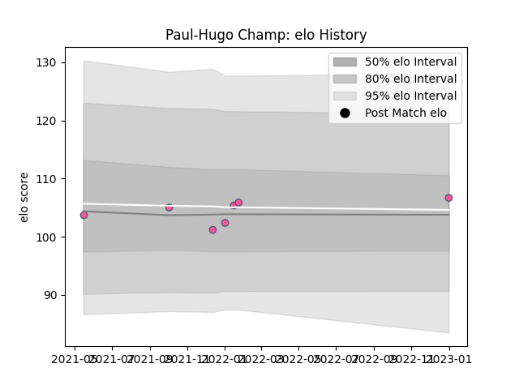

---  
layout: page  
title: Paul-Hugo Champ  
date: 2023-01-06 00:17:21.140727  
categories: player  
---
# Paul-Hugo Champ

## Positions: W

## Current elo: 107.0

## Current Percentile: 56.0

# Elo History

# Match History

| Team                 |   Appearances |   Win Rate |
|:---------------------|--------------:|-----------:|
| Stade Francais Paris |             7 |   0.571429 |

| Opponent            |   Matches |   Win Rate |
|:--------------------|----------:|-----------:|
| Connacht            |         2 |        0.5 |
| Bristol Rugby       |         1 |        0   |
| Brive               |         1 |        0   |
| Montpellier Herault |         1 |        1   |
| Pau                 |         1 |        1   |
| Perpignan           |         1 |        1   |