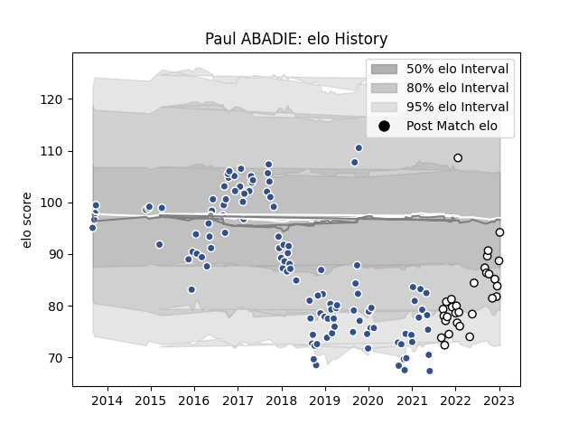

---  
layout: page  
title: Paul ABADIE  
date: 2023-02-02 18:45:51.234355  
categories: player  
---
# Paul ABADIE

## Positions: SH

## Current elo: 90.0

## Current Percentile: 43.0

# Elo History

# Match History

| Team   |   Appearances |   Win Rate |
|:-------|--------------:|-----------:|
| Agen   |           116 |   0.301724 |
| Brive  |            31 |   0.322581 |

| Opponent             |   Matches |   Win Rate |
|:---------------------|----------:|-----------:|
| Pau                  |        12 |   0.166667 |
| Toulon               |        10 |   0.2      |
| La Rochelle          |         9 |   0.111111 |
| Stade Toulousain     |         8 |   0        |
| Racing 92            |         8 |   0.3125   |
| Bordeaux Begles      |         7 |   0.142857 |
| Stade Francais Paris |         7 |   0.571429 |
| Castres Olympique    |         7 |   0.142857 |
| Lyon                 |         7 |   0.142857 |
| Bayonne              |         6 |   0.333333 |
| Biarritz Olympique   |         5 |   0.4      |
| Perpignan            |         5 |   0.6      |
| Clermont Auvergne    |         5 |   0        |
| Montpellier Herault  |         5 |   0.4      |
| Grenoble             |         4 |   0.375    |
| Oyonnax              |         3 |   0.333333 |
| Narbonne             |         3 |   0.666667 |
| Albi                 |         3 |   0.666667 |
| Brive                |         3 |   0.666667 |
| Beziers              |         3 |   0        |
| Edinburgh            |         3 |   0        |
| Bourgoin-Jallieu     |         3 |   1        |
| London Irish         |         2 |   0        |
| Vannes               |         2 |   0.75     |
| Colomiers            |         2 |   0.25     |
| Soyaux-Angouleme     |         2 |   1        |
| Carcassonne          |         2 |   0.5      |
| Harlequins           |         1 |   0        |
| Wasps                |         1 |   0        |
| Benetton Treviso     |         1 |   1        |
| Cardiff Blues        |         1 |   0        |
| Aurillac             |         1 |   1        |
| Connacht             |         1 |   0        |
| Montauban            |         1 |   1        |
| Mont-de-Marsan       |         1 |   1        |
| Massy                |         1 |   1        |
| Gloucester Rugby     |         1 |   0        |
| Zebre                |         1 |   0        |