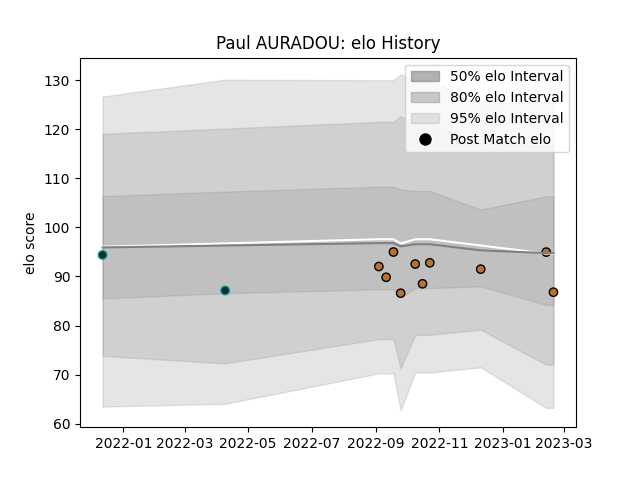

---  
layout: page  
title: Paul AURADOU  
date: 2023-02-16 11:19:24.465566  
categories: player  
---
# Paul AURADOU

## Positions: FH, FB

## Current elo: 94.0

## Current Percentile: 38.0

# Elo History

# Match History

| Team     |   Appearances |   Win Rate |
|:---------|--------------:|-----------:|
| Narbonne |             9 |   0.333333 |
| Pau      |             2 |   0        |

| Opponent                   |   Matches |   Win Rate |
|:---------------------------|----------:|-----------:|
| Valence Romans Drome Rugby |         2 |          0 |
| Albi                       |         1 |          0 |
| Bourgoin-Jallieu           |         1 |          0 |
| Dax                        |         1 |          0 |
| Edinburgh                  |         1 |          0 |
| London Irish               |         1 |          0 |
| Nice                       |         1 |          1 |
| Suresnes                   |         1 |          1 |
| Tarbes                     |         1 |          0 |
| US Bressane                |         1 |          1 |