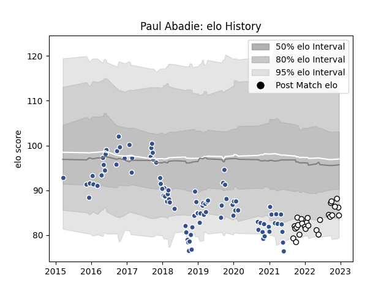

---  
layout: page  
title: Paul Abadie  
date: 2022-12-18 16:38:30.606969  
categories: player  
---
# Paul Abadie

## Positions: SH

## Current elo: 84.0

## Current Percentile: 18.0

# Elo History

# Match History

| Team   |   Appearances |   Win Rate |
|:-------|--------------:|-----------:|
| Agen   |            95 |   0.247368 |
| Brive  |            27 |   0.296296 |

| Opponent             |   Matches |   Win Rate |
|:---------------------|----------:|-----------:|
| Pau                  |        11 |   0.181818 |
| La Rochelle          |         9 |   0.111111 |
| Toulon               |         9 |   0.111111 |
| Stade Toulousain     |         8 |   0        |
| Racing 92            |         7 |   0.285714 |
| Bordeaux Begles      |         7 |   0.142857 |
| Stade Francais Paris |         7 |   0.571429 |
| Castres Olympique    |         7 |   0.142857 |
| Lyon                 |         6 |   0        |
| Bayonne              |         5 |   0.4      |
| Perpignan            |         5 |   0.6      |
| Clermont Auvergne    |         5 |   0        |
| Montpellier Herault  |         5 |   0.4      |
| Grenoble             |         4 |   0.375    |
| Brive                |         3 |   0.666667 |
| Biarritz Olympique   |         3 |   0.666667 |
| Oyonnax              |         2 |   0.5      |
| Edinburgh            |         2 |   0        |
| London Irish         |         2 |   0        |
| Narbonne             |         2 |   0.5      |
| Aurillac             |         1 |   1        |
| Wasps                |         1 |   0        |
| Soyaux-Angouleme     |         1 |   1        |
| Harlequins           |         1 |   0        |
| Mont-de-Marsan       |         1 |   1        |
| Gloucester Rugby     |         1 |   0        |
| Connacht             |         1 |   0        |
| Colomiers            |         1 |   0        |
| Cardiff Blues        |         1 |   0        |
| Bourgoin-Jallieu     |         1 |   1        |
| Beziers              |         1 |   0        |
| Benetton Treviso     |         1 |   1        |
| Zebre                |         1 |   0        |