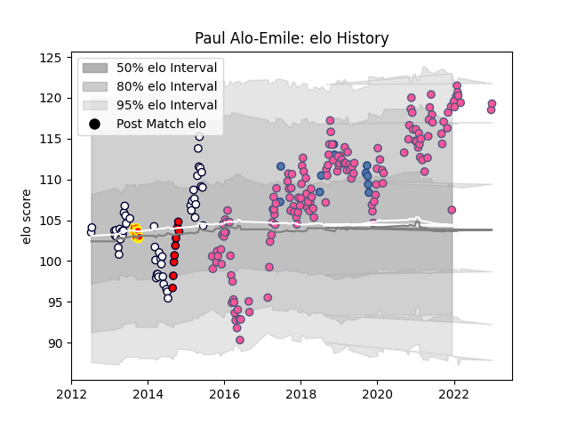

---  
layout: page  
title: Paul Alo-Emile  
date: 2022-12-18 16:37:26.286308  
categories: player  
---
# Paul Alo-Emile

## Positions: P

## Country: Samoa

## Current elo: 106.0

## Current Percentile: 87.0

# Elo History

# Match History

| Team                 |   Appearances |   Win Rate |
|:---------------------|--------------:|-----------:|
| Stade Francais Paris |           148 |   0.483108 |
| Melbourne Rebels     |            50 |   0.32     |
| Samoa                |            11 |   0.272727 |
| Waikato              |            10 |   0.4      |
| Melbourne Rising     |             9 |   0.888889 |

| Opponent                 |   Matches |   Win Rate |
|:-------------------------|----------:|-----------:|
| Pau                      |        12 |   0.583333 |
| Castres Olympique        |        11 |   0.636364 |
| Toulon                   |        11 |   0.363636 |
| Racing 92                |        11 |   0.363636 |
| Montpellier Herault      |        11 |   0.318182 |
| Stade Toulousain         |        10 |   0.5      |
| Bordeaux Begles          |        10 |   0.4      |
| La Rochelle              |        10 |   0.6      |
| Lyon                     |         8 |   0.125    |
| Agen                     |         7 |   0.571429 |
| Clermont Auvergne        |         7 |   0.142857 |
| Brive                    |         7 |   0.571429 |
| Western Force            |         6 |   0.666667 |
| Queensland Reds          |         6 |   0.333333 |
| New South Wales Waratahs |         6 |   0.166667 |
| Brumbies                 |         6 |   0.333333 |
| Grenoble                 |         5 |   0.6      |
| Oyonnax                  |         4 |   0.5      |
| Lions                    |         4 |   0        |
| Chiefs                   |         3 |   0.333333 |
| Stormers                 |         3 |   0.333333 |
| Crusaders                |         3 |   0.333333 |
| Bayonne                  |         3 |   0.666667 |
| Sharks                   |         3 |   0        |
| Perpignan                |         2 |   1        |
| Blues                    |         2 |   0.5      |
| Benetton Treviso         |         2 |   1        |
| Ospreys                  |         2 |   1        |
| Munster                  |         2 |   0.5      |
| Bulls                    |         2 |   0.5      |
| Leicester Tigers         |         2 |   0.5      |
| Perth Spirit             |         2 |   0.5      |
| Edinburgh                |         2 |   0.5      |
| Germany                  |         2 |   1        |
| Hurricanes               |         2 |   0        |
| Highlanders              |         2 |   0.5      |
| Cheetahs                 |         2 |   0.5      |
| Wales                    |         1 |   0        |
| Worcester Warriors       |         1 |   0        |
| Australia                |         1 |   0        |
| Wellington               |         1 |   0        |
| Russia                   |         1 |   1        |
| Scotland                 |         1 |   0        |
| United States of America |         1 |   0        |
| Southern Kings           |         1 |   0        |
| Bath Rugby               |         1 |   1        |
| Bay of Plenty            |         1 |   1        |
| Sydney Stars             |         1 |   1        |
| Queensland Country       |         1 |   1        |
| Taranaki                 |         1 |   1        |
| Tasman                   |         1 |   0        |
| Southland                |         1 |   0        |
| Northland                |         1 |   1        |
| Brisbane City            |         1 |   1        |
| Canterbury               |         1 |   0        |
| Counties Manukau         |         1 |   0        |
| Georgia                  |         1 |   0        |
| Gloucester Rugby         |         1 |   1        |
| Greater Sydney Rams      |         1 |   1        |
| Ireland                  |         1 |   0        |
| Japan                    |         1 |   0        |
| Krasny Yar               |         1 |   1        |
| Auckland                 |         1 |   1        |
| Otago                    |         1 |   0        |
| London Irish             |         1 |   0        |
| Canberra Vikings         |         1 |   1        |
| NSW Country Eagles       |         1 |   1        |
| Bristol Rugby            |         1 |   0        |
| New Zealand              |         1 |   0        |
| North Harbour Rays       |         1 |   1        |
| Connacht                 |         1 |   1        |
| Zebre                    |         1 |   1        |