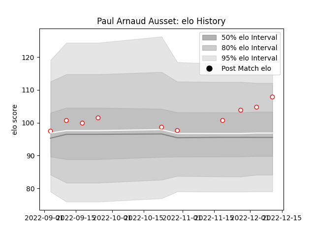

---  
layout: page  
title: Paul Arnaud Ausset  
date: 2022-12-18 16:39:32.186073  
categories: player  
---
# Paul Arnaud Ausset

## Positions: FL, N8

## Current elo: 108.0

## Current Percentile: 85.0

# Elo History

# Match History

| Team   |   Appearances |   Win Rate |
|:-------|--------------:|-----------:|
| Dax    |            11 |   0.818182 |

| Opponent                   |   Matches |   Win Rate |
|:---------------------------|----------:|-----------:|
| US Bressane                |         2 |          1 |
| Albi                       |         1 |          0 |
| Blagnac                    |         1 |          1 |
| Bourgoin-Jallieu           |         1 |          0 |
| Carqueiranne-Hyères        |         1 |          1 |
| Chambery                   |         1 |          1 |
| Narbonne                   |         1 |          1 |
| Nice                       |         1 |          1 |
| Tarbes                     |         1 |          1 |
| Valence Romans Drome Rugby |         1 |          1 |