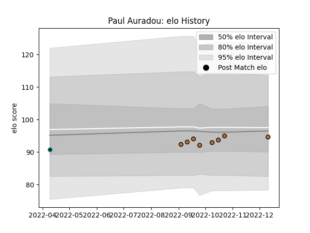

---  
layout: page  
title: Paul Auradou  
date: 2022-12-14 11:36:24.815995  
categories: player  
---
# Paul Auradou

## Positions: FH, FB

## Current elo: 95.0

## Current Percentile: 44.0

# Elo History

# Match History

| Team     |   Appearances |   Win Rate |
|:---------|--------------:|-----------:|
| Narbonne |             8 |      0.375 |
| Pau      |             1 |      0     |

| Opponent                   |   Matches |   Win Rate |
|:---------------------------|----------:|-----------:|
| Albi                       |         1 |          0 |
| Bourgoin-Jallieu           |         1 |          0 |
| Dax                        |         1 |          0 |
| Edinburgh                  |         1 |          0 |
| Nice                       |         1 |          1 |
| Suresnes                   |         1 |          1 |
| Tarbes                     |         1 |          0 |
| US Bressane                |         1 |          1 |
| Valence Romans Drome Rugby |         1 |          0 |