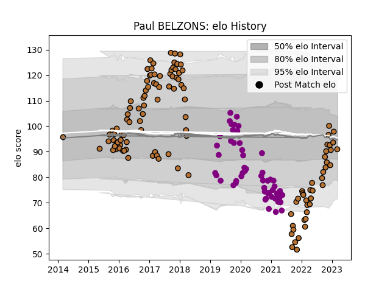

---  
layout: page  
title: Paul BELZONS  
date: 2023-03-17 17:19:52.181421  
categories: player  
---
# Paul BELZONS

## Positions: FL

## Current elo: 87.0

## Current Percentile: 38.0

# Elo History

# Match History

| Team             |   Appearances |   Win Rate |
|:-----------------|--------------:|-----------:|
| Narbonne         |           121 |   0.371901 |
| Soyaux-Angouleme |            55 |   0.409091 |

| Opponent                   |   Matches |   Win Rate |
|:---------------------------|----------:|-----------:|
| Montauban                  |        12 |   0.291667 |
| Aurillac                   |        11 |   0.363636 |
| Mont-de-Marsan             |        11 |   0.454545 |
| Carcassonne                |        11 |   0.409091 |
| Colomiers                  |        11 |   0.318182 |
| Perpignan                  |         9 |   0.111111 |
| Beziers                    |         9 |   0.444444 |
| Biarritz Olympique         |         9 |   0.222222 |
| Vannes                     |         7 |   0.428571 |
| Nevers                     |         7 |   0.142857 |
| Oyonnax                    |         7 |   0.142857 |
| Bayonne                    |         7 |   0.285714 |
| Dax                        |         6 |   0.5      |
| Grenoble                   |         6 |   0.25     |
| Rouen                      |         6 |   0.5      |
| Provence Rugby             |         6 |   0.666667 |
| US Bressane                |         4 |   0.75     |
| Albi                       |         4 |   0.375    |
| Bourgoin-Jallieu           |         4 |   0.5      |
| Soyaux-Angouleme           |         4 |   0.5      |
| Tarbes                     |         3 |   0        |
| Valence Romans Drome Rugby |         3 |   0.5      |
| Agen                       |         3 |   0.333333 |
| Nice                       |         2 |   1        |
| Lyon                       |         2 |   0.5      |
| Roval Drome XV             |         2 |   0.5      |
| Suresnes                   |         2 |   1        |
| Chambery                   |         2 |   0        |
| Massy                      |         2 |   0.5      |
| Rennes                     |         1 |   1        |
| Cognac Saint Jean d'Angély |         1 |   1        |
| Carqueiranne-Hyères        |         1 |   1        |
| Blagnac                    |         1 |   0.5      |