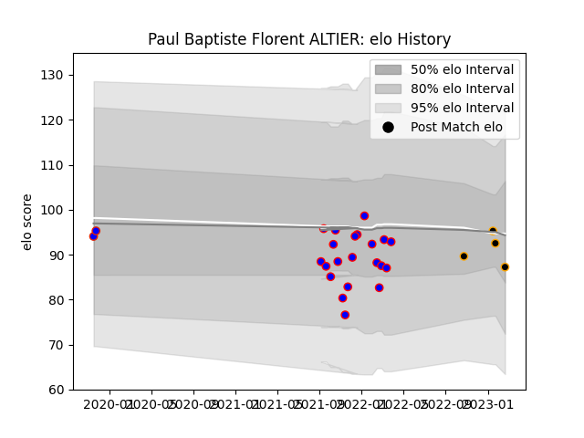

---  
layout: page  
title: Paul Baptiste Florent ALTIER  
date: 2023-02-28 11:08:06.321946  
categories: player  
---
# Paul Baptiste Florent ALTIER

## Positions: FB

## Country: Hong Kong

## Current elo: 87.0

## Current Percentile: 44.0

# Elo History

# Match History

| Team      |   Appearances |   Win Rate |
|:----------|--------------:|-----------:|
| Dijon     |            21 |   0.333333 |
| Chambery  |             4 |   0.25     |
| Hong Kong |             2 |   0.5      |

| Opponent                   |   Matches |   Win Rate |
|:---------------------------|----------:|-----------:|
| Dax                        |         3 |   0.333333 |
| Albi                       |         2 |   0        |
| Cognac Saint Jean d'Angély |         2 |   0        |
| Tarbes                     |         2 |   0.25     |
| Soyaux-Angouleme           |         2 |   0.5      |
| Nice                       |         2 |   0.5      |
| Aubenas                    |         2 |   0.75     |
| Massy                      |         2 |   0        |
| Chambery                   |         1 |   0        |
| Carqueiranne-Hyères        |         1 |   0        |
| Bourgoin-Jallieu           |         1 |   1        |
| Rennes                     |         1 |   0        |
| Blagnac                    |         1 |   0        |
| Spain                      |         1 |   0        |
| Suresnes                   |         1 |   0        |
| Belgium                    |         1 |   1        |
| US Bressane                |         1 |   1        |
| Valence Romans Drome Rugby |         1 |   1        |