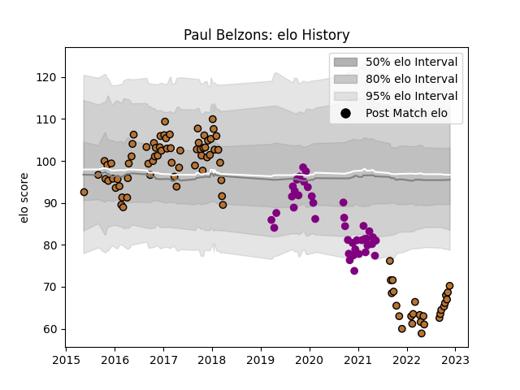

---  
layout: page  
title: Paul Belzons  
date: 2022-11-22 11:36:04.186390  
categories: player  
---
# Paul Belzons

## Positions: FL

## Current elo: 70.0

## Current Percentile: 1.0

# Elo History

# Match History

| Team             |   Appearances |   Win Rate |
|:-----------------|--------------:|-----------:|
| Narbonne         |            91 |   0.406593 |
| Soyaux-Angouleme |            40 |   0.3875   |

| Opponent                   |   Matches |   Win Rate |
|:---------------------------|----------:|-----------:|
| Aurillac                   |        10 |   0.4      |
| Colomiers                  |         9 |   0.388889 |
| Montauban                  |         9 |   0.277778 |
| Biarritz Olympique         |         9 |   0.222222 |
| Carcassonne                |         8 |   0.4375   |
| Beziers                    |         8 |   0.5      |
| Mont-de-Marsan             |         7 |   0.428571 |
| Grenoble                   |         6 |   0.25     |
| Vannes                     |         6 |   0.333333 |
| Perpignan                  |         6 |   0.166667 |
| Nevers                     |         5 |   0.2      |
| Oyonnax                    |         5 |   0.2      |
| Provence Rugby             |         4 |   0.75     |
| Soyaux-Angouleme           |         4 |   0.5      |
| Albi                       |         4 |   0.375    |
| Rouen                      |         4 |   0.5      |
| Dax                        |         3 |   0.666667 |
| Bourgoin-Jallieu           |         3 |   0.333333 |
| Valence Romans Drome Rugby |         3 |   0.5      |
| Bayonne                    |         3 |   0.333333 |
| US Bressane                |         2 |   1        |
| Tarbes                     |         2 |   0        |
| Agen                       |         2 |   0.5      |
| Massy                      |         2 |   0.5      |
| Nice                       |         1 |   1        |
| Roval Drome XV             |         1 |   1        |
| Lyon                       |         1 |   1        |
| Suresnes                   |         1 |   1        |
| Cognac Saint Jean d'Angély |         1 |   1        |
| Chambery                   |         1 |   0        |
| Blagnac                    |         1 |   0.5      |