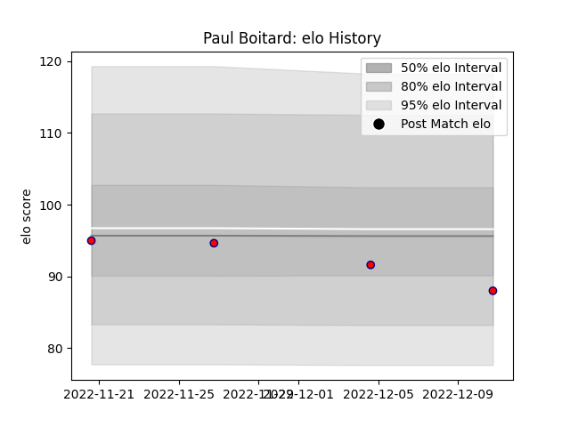

---  
layout: page  
title: Paul Boitard  
date: 2022-12-09 13:17:13.792375  
categories: player  
---
# Paul Boitard

## Positions: W

## Current elo: 92.0

## Current Percentile: None

# Elo History

# Match History

| Team                       |   Appearances |   Win Rate |
|:---------------------------|--------------:|-----------:|
| Cognac Saint Jean d'Angély |             3 |          0 |

| Opponent         |   Matches |   Win Rate |
|:-----------------|----------:|-----------:|
| Bourgoin-Jallieu |         1 |          0 |
| Nice             |         1 |          0 |
| Suresnes         |         1 |          0 |