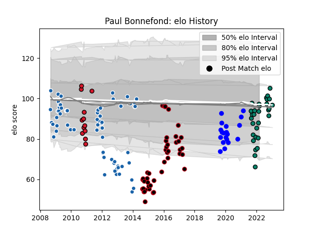

---  
layout: page  
title: Paul Bonnefond  
date: 2023-02-02 19:14:14.740918  
categories: player  
---
# Paul Bonnefond

## Positions: C, W

## Current elo: 97.0

## Current Percentile: 43.0

# Elo History

# Match History

| Team              |   Appearances |   Win Rate |
|:------------------|--------------:|-----------:|
| Castres Olympique |            74 |   0.513514 |
| Lyon              |            44 |   0.534091 |
| Montauban         |            32 |   0.5625   |
| Vannes            |            19 |   0.578947 |
| Oyonnax           |            12 |   0.416667 |

| Opponent             |   Matches |   Win Rate |
|:---------------------|----------:|-----------:|
| Mont-de-Marsan       |        10 |   0.7      |
| Toulon               |        10 |   0.35     |
| Provence Rugby       |         9 |   0.444444 |
| Brive                |         8 |   0.625    |
| Stade Francais Paris |         8 |   0.4375   |
| Colomiers            |         8 |   0.5625   |
| Oyonnax              |         7 |   0.714286 |
| Perpignan            |         7 |   0.571429 |
| Grenoble             |         7 |   0.5      |
| Biarritz Olympique   |         7 |   0.357143 |
| Agen                 |         5 |   0.8      |
| Stade Toulousain     |         5 |   0.2      |
| Northampton Saints   |         5 |   0.4      |
| Bayonne              |         5 |   0.5      |
| Aurillac             |         4 |   0.75     |
| Ospreys              |         4 |   0.25     |
| Nevers               |         4 |   0.75     |
| Carcassonne          |         4 |   0.75     |
| Bordeaux Begles      |         4 |   0.25     |
| Dax                  |         4 |   0.5      |
| Clermont Auvergne    |         4 |   0.375    |
| Lyon                 |         3 |   0.666667 |
| Montauban            |         3 |   0.666667 |
| Narbonne             |         3 |   1        |
| Edinburgh            |         3 |   0.333333 |
| Rouen                |         3 |   0.666667 |
| Tarbes               |         2 |   0.5      |
| US Bressane          |         2 |   0.75     |
| Soyaux-Angouleme     |         2 |   0.5      |
| Scarlets             |         2 |   0        |
| Ulster               |         2 |   0        |
| Vannes               |         2 |   0.5      |
| Munster              |         2 |   0        |
| Newcastle Falcons    |         2 |   0.5      |
| Montpellier Herault  |         2 |   1        |
| Massy                |         2 |   0.5      |
| London Welsh         |         2 |   1        |
| La Rochelle          |         2 |   0.25     |
| Glasgow Warriors     |         2 |   1        |
| Beziers              |         2 |   1        |
| Wasps                |         2 |   0.5      |
| Pau                  |         1 |   0        |
| Racing 92            |         1 |   1        |
| Saint-Etienne        |         1 |   1        |
| Saracens             |         1 |   0        |
| Albi                 |         1 |   0        |
| Castres Olympique    |         1 |   1        |
| Bourgoin-Jallieu     |         1 |   0        |