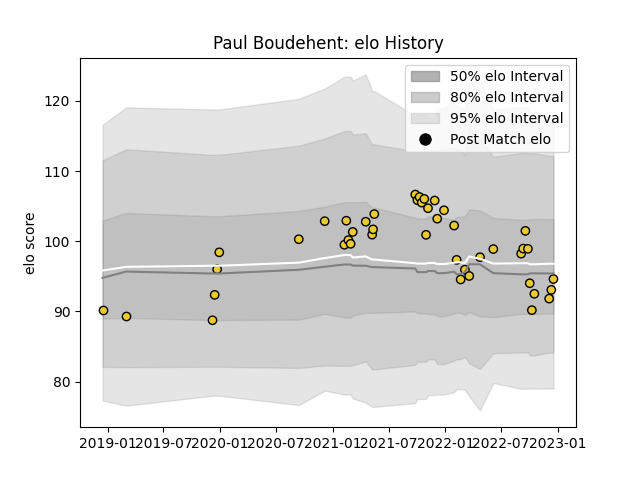

---  
layout: page  
title: Paul Boudehent  
date: 2023-02-02 19:07:30.644730  
categories: player  
---
# Paul Boudehent

## Positions: FL

## Current elo: 93.0

## Current Percentile: 23.0

# Elo History

# Match History

| Team        |   Appearances |   Win Rate |
|:------------|--------------:|-----------:|
| La Rochelle |            51 |   0.568627 |

| Opponent             |   Matches |   Win Rate |
|:---------------------|----------:|-----------:|
| Lyon                 |         5 |   0.8      |
| Montpellier Herault  |         4 |   0.25     |
| Toulon               |         4 |   0.75     |
| Stade Francais Paris |         4 |   0.5      |
| Racing 92            |         4 |   0.25     |
| Perpignan            |         4 |   0.75     |
| Bordeaux Begles      |         3 |   0.333333 |
| Stade Toulousain     |         3 |   0.333333 |
| Brive                |         3 |   0.666667 |
| Northampton Saints   |         2 |   1        |
| Agen                 |         2 |   1        |
| Glasgow Warriors     |         2 |   0.5      |
| Clermont Auvergne    |         2 |   0.5      |
| Castres Olympique    |         2 |   0.5      |
| Biarritz Olympique   |         2 |   0.5      |
| Ulster               |         2 |   1        |
| Bayonne              |         1 |   0        |
| Pau                  |         1 |   1        |
| Bristol Rugby        |         1 |   0        |