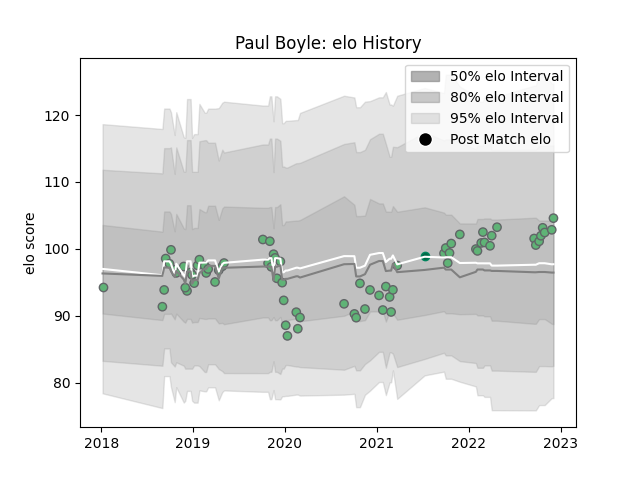

---  
layout: page  
title: Paul Boyle  
date: 2022-12-14 11:37:03.740803  
categories: player  
---
# Paul Boyle

## Positions: N8, FL

## Country: Ireland

## Current elo: 106.0

## Current Percentile: 76.0

# Elo History

# Match History

| Team     |   Appearances |   Win Rate |
|:---------|--------------:|-----------:|
| Connacht |            74 |        0.5 |
| Ireland  |             1 |        1   |

| Opponent                 |   Matches |   Win Rate |
|:-------------------------|----------:|-----------:|
| Munster                  |         9 |   0.111111 |
| Ulster                   |         8 |   0.5      |
| Leinster                 |         6 |   0        |
| Cardiff Blues            |         6 |   0.5      |
| Ospreys                  |         6 |   0.666667 |
| Benetton Treviso         |         5 |   1        |
| Edinburgh                |         4 |   0.25     |
| Scarlets                 |         4 |   0.5      |
| Glasgow Warriors         |         4 |   0.25     |
| Southern Kings           |         3 |   1        |
| Cheetahs                 |         3 |   1        |
| Dragons                  |         2 |   0.5      |
| Stormers                 |         2 |   0.5      |
| Stade Toulousain         |         2 |   0        |
| Sale Sharks              |         2 |   0        |
| United States of America |         1 |   1        |
| Bulls                    |         1 |   1        |
| Perpignan                |         1 |   1        |
| Newcastle Falcons        |         1 |   1        |
| Bordeaux Begles          |         1 |   1        |
| Montpellier Herault      |         1 |   1        |
| Lions                    |         1 |   1        |
| Gloucester Rugby         |         1 |   1        |
| Zebre                    |         1 |   1        |