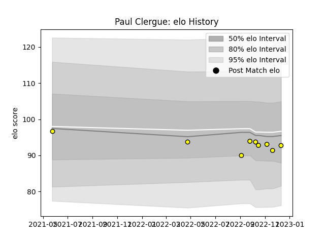

---  
layout: page  
title: Paul Clergue  
date: 2022-12-18 16:32:50.109989  
categories: player  
---
# Paul Clergue

## Positions: FB

## Current elo: 93.0

## Current Percentile: 34.0

# Elo History

# Match History

| Team   |   Appearances |   Win Rate |
|:-------|--------------:|-----------:|
| Albi   |             9 |   0.611111 |

| Opponent                   |   Matches |   Win Rate |
|:---------------------------|----------:|-----------:|
| Bourgoin-Jallieu           |         2 |        1   |
| Blagnac                    |         1 |        0   |
| Cognac Saint Jean d'Angély |         1 |        1   |
| Massy                      |         1 |        0   |
| Narbonne                   |         1 |        1   |
| Nice                       |         1 |        0.5 |
| Tarbes                     |         1 |        0   |
| Valence Romans Drome Rugby |         1 |        1   |