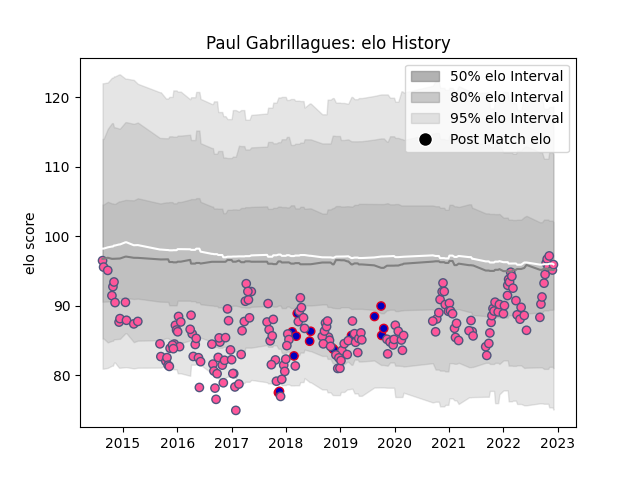

---  
layout: page  
title: Paul Gabrillagues  
date: 2023-02-06 11:15:16.901190  
categories: player  
---
# Paul Gabrillagues

## Positions: L

## Country: France

## Current elo: 92.0

## Current Percentile: 55.0

# Elo History

# Match History

| Team                 |   Appearances |   Win Rate |
|:---------------------|--------------:|-----------:|
| Stade Francais Paris |           194 |   0.484536 |
| France               |            16 |   0.4375   |

| Opponent                 |   Matches |   Win Rate |
|:-------------------------|----------:|-----------:|
| Bordeaux Begles          |        14 |   0.428571 |
| Montpellier Herault      |        14 |   0.321429 |
| La Rochelle              |        13 |   0.576923 |
| Stade Toulousain         |        13 |   0.423077 |
| Clermont Auvergne        |        13 |   0.346154 |
| Castres Olympique        |        12 |   0.583333 |
| Racing 92                |        12 |   0.25     |
| Pau                      |        12 |   0.583333 |
| Toulon                   |        11 |   0.363636 |
| Lyon                     |        10 |   0.4      |
| Brive                    |         9 |   0.444444 |
| Agen                     |         7 |   0.714286 |
| Grenoble                 |         6 |   0.5      |
| Bayonne                  |         6 |   0.666667 |
| Perpignan                |         4 |   1        |
| New Zealand              |         3 |   0        |
| Edinburgh                |         3 |   0.333333 |
| Oyonnax                  |         3 |   0.333333 |
| Leicester Tigers         |         3 |   0.333333 |
| Bucarest Wolves          |         2 |   1        |
| Benetton Treviso         |         2 |   1        |
| Biarritz Olympique       |         2 |   0.5      |
| Ospreys                  |         2 |   1        |
| Newcastle Falcons        |         2 |   0.5      |
| Bucuresti                |         2 |   1        |
| Munster                  |         2 |   0.5      |
| London Irish             |         2 |   0.5      |
| South Africa             |         2 |   0        |
| Italy                    |         2 |   1        |
| Harlequins               |         2 |   0.5      |
| Wales                    |         2 |   0        |
| Dragons                  |         2 |   0        |
| Connacht                 |         2 |   0.5      |
| Scotland                 |         2 |   0.5      |
| Timisoara Saracens       |         1 |   1        |
| Tonga                    |         1 |   1        |
| Bath Rugby               |         1 |   1        |
| United States of America |         1 |   1        |
| Cardiff Blues            |         1 |   1        |
| Northampton Saints       |         1 |   0        |
| Bristol Rugby            |         1 |   0        |
| Argentina                |         1 |   1        |
| Ireland                  |         1 |   0        |
| Gloucester Rugby         |         1 |   1        |
| England                  |         1 |   1        |
| Worcester Warriors       |         1 |   0        |