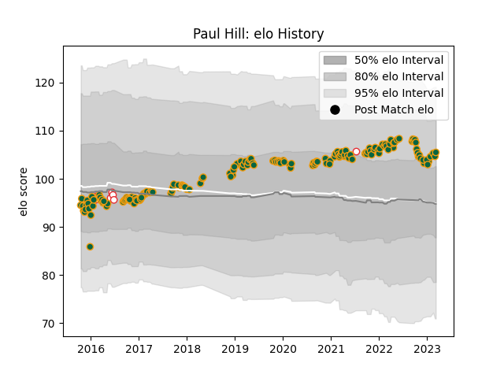

---  
layout: page  
title: Paul Hill  
date: 2023-02-02 19:02:29.244429  
categories: player  
---
# Paul Hill

## Positions: P

## Country: England

## Current elo: 101.0

## Current Percentile: 64.0

# Elo History

# Match History

| Team               |   Appearances |   Win Rate |
|:-------------------|--------------:|-----------:|
| Northampton Saints |           162 |   0.496914 |
| England            |             8 |   1        |

| Opponent            |   Matches |   Win Rate |
|:--------------------|----------:|-----------:|
| Exeter Chiefs       |        16 |   0.375    |
| Leicester Tigers    |        15 |   0.4      |
| Saracens            |        13 |   0.153846 |
| Wasps               |        12 |   0.416667 |
| Sale Sharks         |        12 |   0.416667 |
| Bath Rugby          |        12 |   0.5      |
| Harlequins          |        12 |   0.416667 |
| Gloucester Rugby    |        11 |   0.727273 |
| Newcastle Falcons   |        11 |   0.545455 |
| Worcester Warriors  |        10 |   0.9      |
| Bristol Rugby       |         7 |   0.714286 |
| London Irish        |         7 |   0.857143 |
| Leinster            |         4 |   0        |
| Australia           |         3 |   1        |
| Scarlets            |         3 |   1        |
| Ospreys             |         2 |   0        |
| Benetton Treviso    |         2 |   1        |
| Racing 92           |         2 |   0.25     |
| Glasgow Warriors    |         2 |   1        |
| Montpellier Herault |         2 |   0.5      |
| Castres Olympique   |         2 |   0.5      |
| Munster             |         1 |   0        |
| Dragons             |         1 |   1        |
| Clermont Auvergne   |         1 |   0        |
| Canada              |         1 |   1        |
| La Rochelle         |         1 |   0        |
| Italy               |         1 |   1        |
| Scotland            |         1 |   1        |
| Timisoara Saracens  |         1 |   1        |
| Wales               |         1 |   1        |
| Ireland             |         1 |   1        |