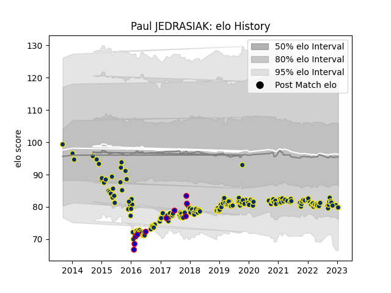

---  
layout: page  
title: Paul JEDRASIAK  
date: 2023-02-10 10:37:12.059557  
categories: player  
---
# Paul JEDRASIAK

## Positions: L

## Country: France

## Current elo: 86.0

## Current Percentile: 24.0

# Elo History

# Match History

| Team              |   Appearances |   Win Rate |
|:------------------|--------------:|-----------:|
| Clermont Auvergne |           188 |   0.558511 |
| France            |            10 |   0.45     |

| Opponent             |   Matches |   Win Rate |
|:---------------------|----------:|-----------:|
| Bordeaux Begles      |        18 |   0.555556 |
| Stade Toulousain     |        17 |   0.441176 |
| Stade Francais Paris |        16 |   0.53125  |
| Toulon               |        13 |   0.461538 |
| Racing 92            |        12 |   0.25     |
| Lyon                 |        11 |   0.545455 |
| Montpellier Herault  |        11 |   0.454545 |
| La Rochelle          |        10 |   0.7      |
| Brive                |         9 |   0.666667 |
| Pau                  |         9 |   0.777778 |
| Castres Olympique    |         7 |   0.428571 |
| Agen                 |         6 |   0.833333 |
| Bayonne              |         6 |   0.5      |
| Grenoble             |         5 |   1        |
| Leicester Tigers     |         4 |   0        |
| Perpignan            |         4 |   0.75     |
| Exeter Chiefs        |         4 |   0.75     |
| Harlequins           |         3 |   1        |
| Northampton Saints   |         3 |   0.666667 |
| Ulster               |         3 |   0.333333 |
| Ospreys              |         3 |   0.666667 |
| Oyonnax              |         3 |   0.333333 |
| South Africa         |         2 |   0        |
| Italy                |         2 |   1        |
| Dragons              |         2 |   1        |
| Saracens             |         2 |   0.5      |
| Biarritz Olympique   |         1 |   1        |
| Wales                |         1 |   0        |
| Japan                |         1 |   0.5      |
| Timisoara Saracens   |         1 |   1        |
| Stormers             |         1 |   0        |
| New Zealand          |         1 |   0        |
| Bristol Rugby        |         1 |   1        |
| Munster              |         1 |   0        |
| Leinster             |         1 |   1        |
| England              |         1 |   0        |
| Ireland              |         1 |   1        |
| Argentina            |         1 |   1        |
| Wasps                |         1 |   1        |