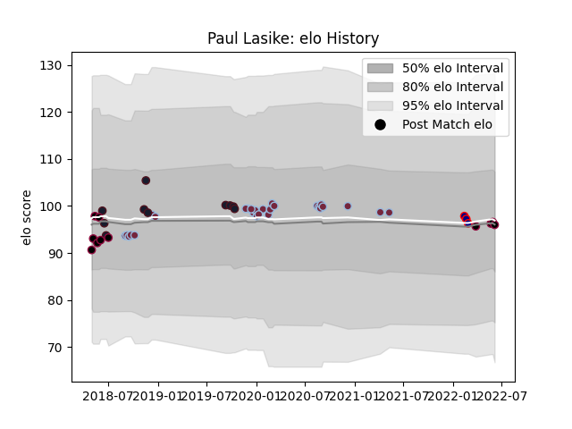

---  
layout: page  
title: Paul Lasike  
date: 2023-03-21 18:06:25.029196  
categories: player  
---
# Paul Lasike

Last updated: 2023-03-21
## Positions: C

## Country: United States of America

## Current elo: 96.0

## Current Percentile: 51.0

# Elo History

# Match History

| Team                     |   Appearances |   Win Rate |
|:-------------------------|--------------:|-----------:|
| Harlequins               |            27 |   0.425926 |
| Utah Warriors            |            11 |   0.363636 |
| United States of America |            10 |   0.6      |
| London Scottish          |             3 |   0        |

| Opponent           |   Matches |   Win Rate |
|:-------------------|----------:|-----------:|
| Bath Rugby         |         5 |   0.4      |
| Saracens           |         3 |   0.333333 |
| Sale Sharks        |         3 |   0.666667 |
| Houston SaberCats  |         2 |   0.5      |
| Wasps              |         2 |   1        |
| Ulster             |         2 |   0        |
| Bristol Rugby      |         2 |   0        |
| Canada             |         2 |   1        |
| Northampton Saints |         2 |   0.5      |
| Leicester Tigers   |         2 |   0.25     |
| Austin Elite Rugby |         2 |   0.5      |
| Glendale Raptors   |         2 |   0        |
| Gloucester Rugby   |         2 |   1        |
| Samoa              |         1 |   1        |
| Argentina          |         1 |   0        |
| San Diego Legion   |         1 |   0        |
| Romania            |         1 |   1        |
| Scotland           |         1 |   1        |
| Seattle Seawolves  |         1 |   0        |
| Tonga              |         1 |   0        |
| Russia             |         1 |   1        |
| L. A. Giltinis     |         1 |   0        |
| Nottingham         |         1 |   0        |
| London Irish       |         1 |   0        |
| Ireland            |         1 |   0        |
| Exeter Chiefs      |         1 |   1        |
| England            |         1 |   0        |
| Dallas Jackals     |         1 |   1        |
| Coventry           |         1 |   0        |
| Cornish Pirates    |         1 |   0        |
| Benetton Treviso   |         1 |   0        |
| Austin Gilgronis   |         1 |   1        |
| Worcester Warriors |         1 |   0        |