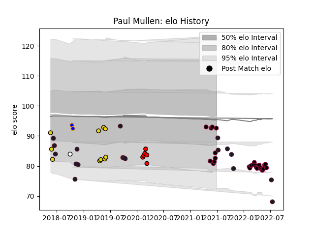

---  
layout: page  
title: Paul Mullen  
date: 2023-03-21 18:24:11.220836  
categories: player  
---
# Paul Mullen

Last updated: 2023-03-21
## Positions: P

## Country: United States of America

## Current elo: 93.0

## Current Percentile: 18.0

# Elo History

# Match History

| Team                     |   Appearances |   Win Rate |
|:-------------------------|--------------:|-----------:|
| Utah Warriors            |            25 |   0.44     |
| United States of America |            19 |   0.421053 |
| Houston SaberCats        |            10 |   0.4      |
| San Diego Legion         |             6 |   1        |
| Doncaster                |             2 |   0        |
| Newcastle Falcons        |             1 |   0        |

| Opponent               |   Matches |   Win Rate |
|:-----------------------|----------:|-----------:|
| Seattle Seawolves      |         6 |   0.333333 |
| San Diego Legion       |         5 |   0.2      |
| NOLA Gold              |         4 |   0.5      |
| Houston SaberCats      |         3 |   0.333333 |
| Austin Gilgronis       |         3 |   0.666667 |
| Canada                 |         3 |   1        |
| L. A. Giltinis         |         3 |   0.333333 |
| Rugby New York         |         2 |   1        |
| Ireland                |         2 |   0        |
| England                |         2 |   0        |
| Toronto Arrows         |         2 |   0        |
| Dallas Jackals         |         2 |   1        |
| R.U. New York          |         2 |   1        |
| Chile                  |         2 |   0.5      |
| Utah Warriors          |         2 |   0.5      |
| New England Free Jacks |         2 |   0.5      |
| Samoa                  |         1 |   1        |
| Argentina              |         1 |   0        |
| Scotland               |         1 |   1        |
| Tonga                  |         1 |   0        |
| Uruguay                |         1 |   0        |
| Russia                 |         1 |   1        |
| New Zealand            |         1 |   0        |
| Rugby ATL              |         1 |   1        |
| Romania                |         1 |   1        |
| Old Glory DC           |         1 |   0        |
| New Zealand Maori      |         1 |   0        |
| Austin Elite Rugby     |         1 |   1        |
| London Irish           |         1 |   0        |
| Glendale Raptors       |         1 |   1        |
| France                 |         1 |   0        |
| Colorado Raptors       |         1 |   1        |
| Bedford                |         1 |   0        |
| Wasps                  |         1 |   0        |