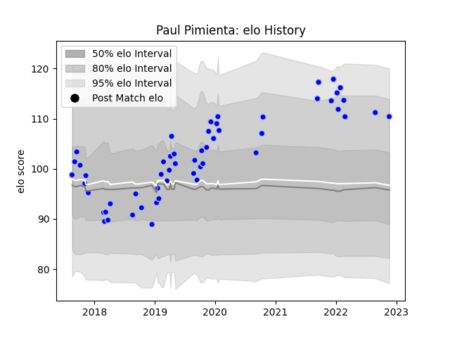

---  
layout: page  
title: Paul Pimienta  
date: 2023-03-21 18:14:41.888321  
categories: player  
---
# Paul Pimienta

Last updated: 2023-03-21
## Positions: C, W

## Current elo: 82.0

## Current Percentile: 97.0

# Elo History

# Match History

| Team      |   Appearances |   Win Rate |
|:----------|--------------:|-----------:|
| Colomiers |            78 |   0.596154 |

| Opponent                   |   Matches |   Win Rate |
|:---------------------------|----------:|-----------:|
| Aurillac                   |         7 |   0.571429 |
| Vannes                     |         6 |   0.5      |
| Beziers                    |         6 |   0.666667 |
| Soyaux-Angouleme           |         6 |   0.5      |
| Carcassonne                |         5 |   0.6      |
| Grenoble                   |         5 |   0.6      |
| Montauban                  |         5 |   0.4      |
| Provence Rugby             |         4 |   0.5      |
| Bayonne                    |         4 |   0.25     |
| Biarritz Olympique         |         4 |   0.75     |
| Massy                      |         4 |   0.5      |
| Mont-de-Marsan             |         4 |   0.75     |
| Rouen                      |         4 |   1        |
| Nevers                     |         3 |   0.666667 |
| US Bressane                |         2 |   1        |
| Agen                       |         2 |   0.5      |
| Oyonnax                    |         2 |   0.5      |
| Perpignan                  |         1 |   1        |
| Roval Drome XV             |         1 |   1        |
| Brive                      |         1 |   1        |
| Valence Romans Drome Rugby |         1 |   0        |
| Narbonne                   |         1 |   0.5      |