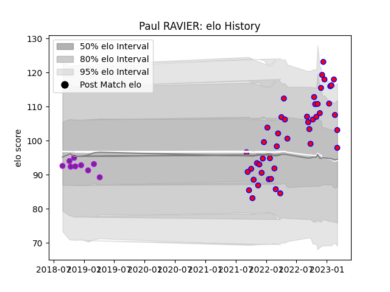

---  
layout: page  
title: Paul RAVIER  
date: 2023-02-02 18:41:35.131030  
categories: player  
---
# Paul RAVIER

## Positions: SH

## Current elo: 116.0

## Current Percentile: 90.0

# Elo History

# Match History

| Team        |   Appearances |   Win Rate |
|:------------|--------------:|-----------:|
| Blagnac     |            42 |   0.547619 |
| US Bressane |             9 |   0.333333 |

| Opponent                   |   Matches |   Win Rate |
|:---------------------------|----------:|-----------:|
| Albi                       |         4 |   0.25     |
| Tarbes                     |         4 |   0.875    |
| Chambery                   |         3 |   0.666667 |
| Suresnes                   |         3 |   0.666667 |
| Nice                       |         3 |   0.333333 |
| Massy                      |         3 |   0.666667 |
| Dax                        |         3 |   0.333333 |
| Cognac Saint Jean d'Angély |         3 |   0.333333 |
| Valence Romans Drome Rugby |         3 |   0.666667 |
| Bourgoin-Jallieu           |         3 |   0.666667 |
| Brive                      |         2 |   0.5      |
| Aubenas                    |         2 |   1        |
| Soyaux-Angouleme           |         2 |   0        |
| US Bressane                |         2 |   0.5      |
| Dijon                      |         2 |   0.5      |
| Carqueiranne-Hyères        |         1 |   1        |
| Carcassonne                |         1 |   0        |
| Montauban                  |         1 |   0        |
| Narbonne                   |         1 |   0.5      |
| Nevers                     |         1 |   0        |
| Biarritz Olympique         |         1 |   1        |
| Rennes                     |         1 |   1        |
| Bayonne                    |         1 |   0        |
| Aurillac                   |         1 |   0        |