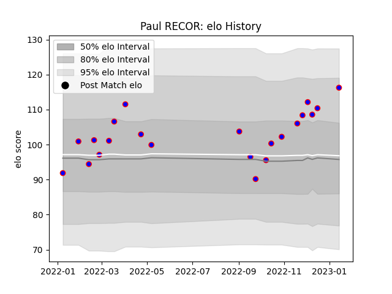

---  
layout: page  
title: Paul RECOR  
date: 2023-03-29 11:29:57.404882  
categories: player  
---
# Paul RECOR

Last updated: 2023-03-29
## Positions: C

## Current elo: 114.0

## Current Percentile: 92.0

# Elo History

# Match History

| Team    |   Appearances |   Win Rate |
|:--------|--------------:|-----------:|
| Beziers |            24 |      0.625 |

| Opponent           |   Matches |   Win Rate |
|:-------------------|----------:|-----------:|
| Montauban          |         3 |        1   |
| Agen               |         2 |        1   |
| Aurillac           |         2 |        0.5 |
| Rouen              |         2 |        0.5 |
| Nevers             |         2 |        0   |
| Vannes             |         2 |        0.5 |
| Grenoble           |         1 |        1   |
| Massy              |         1 |        1   |
| Colomiers          |         1 |        0   |
| Carcassonne        |         1 |        1   |
| Narbonne           |         1 |        1   |
| Biarritz Olympique |         1 |        1   |
| Provence Rugby     |         1 |        0   |
| Bayonne            |         1 |        1   |
| Soyaux-Angouleme   |         1 |        0   |
| US Bressane        |         1 |        0   |
| Mont-de-Marsan     |         1 |        1   |