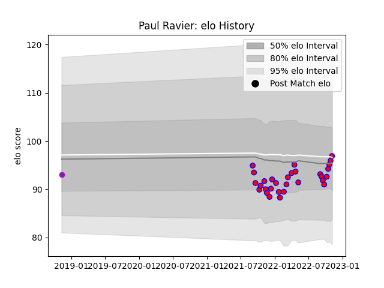

---  
layout: page  
title: Paul Ravier  
date: 2022-11-15 23:43:16.278788  
categories: player  
---
# Paul Ravier

## Positions: SH

## Current elo: 97.0

## Current Percentile: 52.0

# Elo History

# Match History

| Team        |   Appearances |   Win Rate |
|:------------|--------------:|-----------:|
| Blagnac     |            30 |   0.566667 |
| US Bressane |             1 |   0        |

| Opponent                   |   Matches |   Win Rate |
|:---------------------------|----------:|-----------:|
| Tarbes                     |         3 |   1        |
| Chambery                   |         3 |   0.666667 |
| Cognac Saint Jean d'Angély |         3 |   0.333333 |
| Albi                       |         2 |   0.5      |
| Aubenas                    |         2 |   1        |
| Soyaux-Angouleme           |         2 |   0        |
| Massy                      |         2 |   0.5      |
| Dijon                      |         2 |   0.5      |
| Dax                        |         2 |   0        |
| Bourgoin-Jallieu           |         2 |   0.5      |
| Valence Romans Drome Rugby |         2 |   0.5      |
| Carqueiranne-Hyères        |         1 |   1        |
| Nice                       |         1 |   1        |
| Rennes                     |         1 |   1        |
| Suresnes                   |         1 |   1        |
| Bayonne                    |         1 |   0        |
| US Bressane                |         1 |   0        |