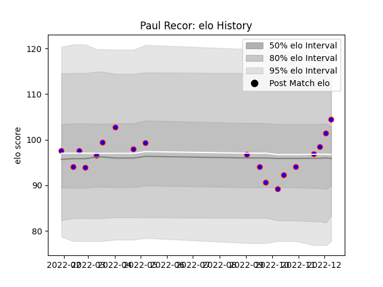

---  
layout: page  
title: Paul Recor  
date: 2022-12-09 13:11:39.374533  
categories: player  
---
# Paul Recor

## Positions: C

## Current elo: 104.0

## Current Percentile: 68.0

# Elo History

# Match History

| Team    |   Appearances |   Win Rate |
|:--------|--------------:|-----------:|
| Beziers |            19 |   0.578947 |

| Opponent         |   Matches |   Win Rate |
|:-----------------|----------:|-----------:|
| Agen             |         2 |        1   |
| Montauban        |         2 |        1   |
| Nevers           |         2 |        0   |
| Rouen            |         2 |        0.5 |
| Vannes           |         2 |        0.5 |
| Aurillac         |         1 |        0   |
| Bayonne          |         1 |        1   |
| Colomiers        |         1 |        0   |
| Grenoble         |         1 |        1   |
| Massy            |         1 |        1   |
| Mont-de-Marsan   |         1 |        1   |
| Narbonne         |         1 |        1   |
| Soyaux-Angouleme |         1 |        0   |
| US Bressane      |         1 |        0   |