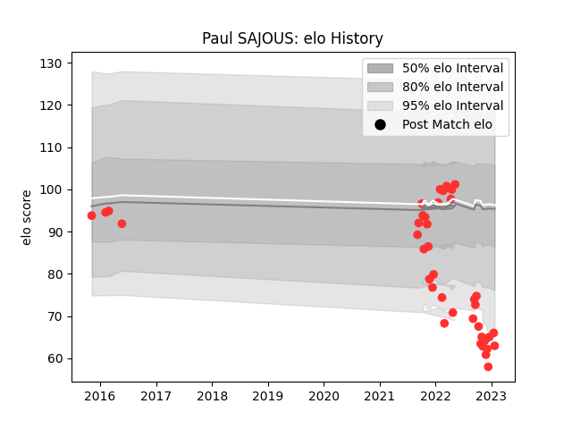

---  
layout: page  
title: Paul SAJOUS  
date: 2023-01-31 10:55:02.252664  
categories: player  
---
# Paul SAJOUS

## Positions: L, FL

## Current elo: 63.0

## Current Percentile: 3.0

# Elo History

# Match History

| Team   |   Appearances |   Win Rate |
|:-------|--------------:|-----------:|
| Tarbes |            41 |   0.414634 |

| Opponent                   |   Matches |   Win Rate |
|:---------------------------|----------:|-----------:|
| Albi                       |         4 |   0.5      |
| Blagnac                    |         4 |   0.125    |
| Bourgoin-Jallieu           |         4 |   0.75     |
| Chambery                   |         4 |   0.5      |
| Cognac Saint Jean d'Angély |         3 |   1        |
| Nice                       |         3 |   0        |
| Dax                        |         3 |   0.333333 |
| Valence Romans Drome Rugby |         3 |   0.333333 |
| Massy                      |         2 |   0        |
| Suresnes                   |         2 |   0        |
| Dijon                      |         2 |   0.75     |
| Carqueiranne-Hyères        |         1 |   0        |
| Aubenas                    |         1 |   1        |
| Lyon                       |         1 |   0        |
| Beziers                    |         1 |   0        |
| Rennes                     |         1 |   1        |
| Soyaux-Angouleme           |         1 |   1        |
| US Bressane                |         1 |   0        |