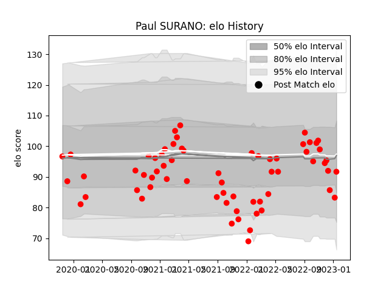

---  
layout: page  
title: Paul SURANO  
date: 2023-03-12 11:32:41.916695  
categories: player  
---
# Paul SURANO

## Positions: W

## Current elo: 89.0

## Current Percentile: 22.0

# Elo History

# Match History

| Team   |   Appearances |   Win Rate |
|:-------|--------------:|-----------:|
| Rouen  |            67 |   0.395522 |

| Opponent                   |   Matches |   Win Rate |
|:---------------------------|----------:|-----------:|
| Grenoble                   |         6 |   0.333333 |
| Provence Rugby             |         6 |   0.416667 |
| Aurillac                   |         6 |   0.333333 |
| Beziers                    |         5 |   0.6      |
| Oyonnax                    |         5 |   0.6      |
| Agen                       |         4 |   0.25     |
| Soyaux-Angouleme           |         4 |   0.75     |
| Montauban                  |         4 |   0.5      |
| Colomiers                  |         4 |   0.25     |
| Carcassonne                |         4 |   0        |
| Vannes                     |         4 |   0.75     |
| Nevers                     |         3 |   0.333333 |
| Biarritz Olympique         |         3 |   0.333333 |
| Mont-de-Marsan             |         2 |   0        |
| Narbonne                   |         2 |   0.5      |
| Massy                      |         1 |   1        |
| Perpignan                  |         1 |   0        |
| Bayonne                    |         1 |   0        |
| US Bressane                |         1 |   0        |
| Valence Romans Drome Rugby |         1 |   0        |