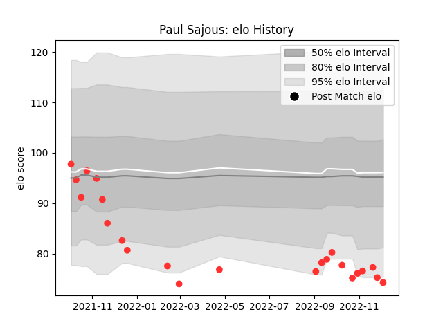

---  
layout: page  
title: Paul Sajous  
date: 2022-12-09 13:18:39.467330  
categories: player  
---
# Paul Sajous

## Positions: L, FL

## Current elo: 74.0

## Current Percentile: 4.0

# Elo History

# Match History

| Team   |   Appearances |   Win Rate |
|:-------|--------------:|-----------:|
| Tarbes |            23 |   0.304348 |

| Opponent                   |   Matches |   Win Rate |
|:---------------------------|----------:|-----------:|
| Blagnac                    |         3 |        0   |
| Nice                       |         3 |        0   |
| Albi                       |         2 |        0.5 |
| Chambery                   |         2 |        0   |
| Cognac Saint Jean d'Angély |         2 |        1   |
| Dax                        |         2 |        0.5 |
| Suresnes                   |         2 |        0   |
| Valence Romans Drome Rugby |         2 |        0   |
| Bourgoin-Jallieu           |         1 |        1   |
| Carqueiranne-Hyères        |         1 |        0   |
| Dijon                      |         1 |        1   |
| Massy                      |         1 |        0   |
| Rennes                     |         1 |        1   |