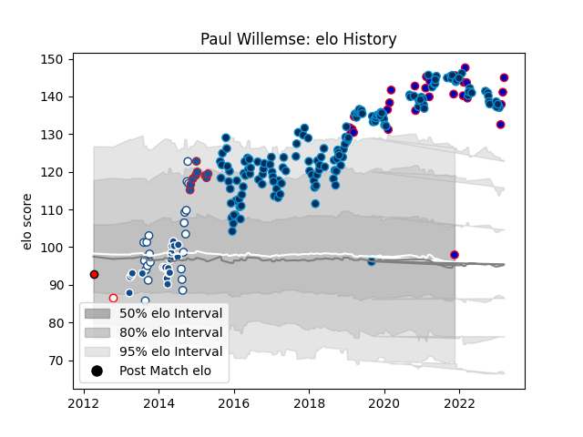

---  
layout: page  
title: Paul Willemse  
date: 2023-01-06 00:20:33.532810  
categories: player  
---
# Paul Willemse

## Positions: L

## Country: France

## Current elo: 106.0

## Current Percentile: 96.0

# Elo History

# Match History

| Team                |   Appearances |   Win Rate |
|:--------------------|--------------:|-----------:|
| Montpellier Herault |           146 |   0.578767 |
| France              |            23 |   0.782609 |
| Blue Bulls          |            21 |   0.452381 |
| Bulls               |            20 |   0.475    |
| Grenoble            |             9 |   0.333333 |
| Golden Lions        |             1 |   0        |
| Lions               |             1 |   0        |

| Opponent                 |   Matches |   Win Rate |
|:-------------------------|----------:|-----------:|
| Castres Olympique        |        14 |   0.428571 |
| Clermont Auvergne        |        12 |   0.666667 |
| Stade Toulousain         |        12 |   0.5      |
| Toulon                   |        11 |   0.545455 |
| Bordeaux Begles          |        11 |   0.545455 |
| Racing 92                |        11 |   0.363636 |
| Lyon                     |        11 |   0.363636 |
| Pau                      |         8 |   0.5      |
| La Rochelle              |         8 |   0.625    |
| Agen                     |         7 |   0.714286 |
| Brive                    |         6 |   0.333333 |
| Wales                    |         5 |   0.8      |
| Stade Francais Paris     |         5 |   0.9      |
| Oyonnax                  |         5 |   1        |
| Western Province         |         5 |   0.1      |
| Ireland                  |         4 |   0.75     |
| Italy                    |         4 |   1        |
| England                  |         4 |   0.5      |
| Perpignan                |         4 |   1        |
| Golden Lions             |         4 |   0.25     |
| Grenoble                 |         4 |   0.75     |
| Harlequins               |         3 |   0.666667 |
| Cheetahs                 |         3 |   0.666667 |
| Brumbies                 |         3 |   0.333333 |
| Scotland                 |         3 |   0.666667 |
| Griquas                  |         3 |   1        |
| Natal Sharks             |         3 |   0        |
| Free State Cheetahs      |         3 |   0.666667 |
| Sharks                   |         2 |   0.5      |
| Stormers                 |         2 |   0.5      |
| Biarritz Olympique       |         2 |   1        |
| Calvisano                |         2 |   1        |
| Cardiff Blues            |         2 |   0.5      |
| Northampton Saints       |         2 |   0.5      |
| Bayonne                  |         2 |   0        |
| Newcastle Falcons        |         2 |   0.5      |
| Connacht                 |         2 |   0.5      |
| Lions                    |         2 |   0.5      |
| Eastern Province Kings   |         2 |   1        |
| Leinster                 |         2 |   0.5      |
| Edinburgh                |         2 |   0.5      |
| Gloucester Rugby         |         2 |   0.5      |
| Dragons                  |         1 |   1        |
| Highlanders              |         1 |   0        |
| Western Force            |         1 |   0        |
| Georgia                  |         1 |   1        |
| Blue Bulls               |         1 |   0        |
| Blues                    |         1 |   1        |
| Southern Kings           |         1 |   1        |
| Sale Sharks              |         1 |   1        |
| New Zealand              |         1 |   1        |
| Hurricanes               |         1 |   0        |
| Queensland Reds          |         1 |   0        |
| Pumas                    |         1 |   1        |
| Argentina                |         1 |   1        |
| Chiefs                   |         1 |   0.5      |
| Ospreys                  |         1 |   0        |
| Melbourne Rebels         |         1 |   1        |
| New South Wales Waratahs |         1 |   0        |