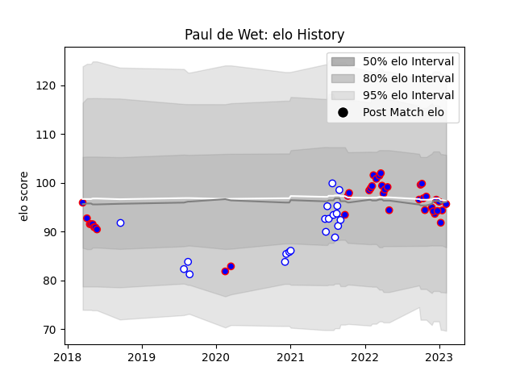

---  
layout: page  
title: Paul de Wet  
date: 2023-02-05 15:15:16.976144  
categories: player  
---
# Paul de Wet

## Positions: SH

## Current elo: 96.0

## Current Percentile: 45.0

# Elo History

# Match History

| Team             |   Appearances |   Win Rate |
|:-----------------|--------------:|-----------:|
| Stormers         |            40 |     0.6875 |
| Western Province |            20 |     0.525  |

| Opponent            |   Matches |   Win Rate |
|:--------------------|----------:|-----------:|
| Lions               |         6 |   0.666667 |
| Golden Lions        |         5 |   0.4      |
| Sharks              |         5 |   0.5      |
| Griquas             |         4 |   0.25     |
| Bulls               |         4 |   1        |
| Pumas               |         3 |   0.833333 |
| Blue Bulls          |         3 |   0.333333 |
| Free State Cheetahs |         3 |   0.666667 |
| Ospreys             |         2 |   0.75     |
| Natal Sharks        |         2 |   1        |
| London Irish        |         2 |   1        |
| Zebre               |         2 |   1        |
| Glasgow Warriors    |         2 |   0.5      |
| Edinburgh           |         2 |   0.75     |
| Dragons             |         2 |   1        |
| Connacht            |         2 |   0.5      |
| Cardiff Blues       |         2 |   0.5      |
| Leinster            |         1 |   1        |
| Melbourne Rebels    |         1 |   1        |
| Clermont Auvergne   |         1 |   0        |
| Chiefs              |         1 |   0        |
| Scarlets            |         1 |   1        |
| Blues               |         1 |   1        |
| Sunwolves           |         1 |   0        |
| Ulster              |         1 |   1        |
| Benetton Treviso    |         1 |   0        |