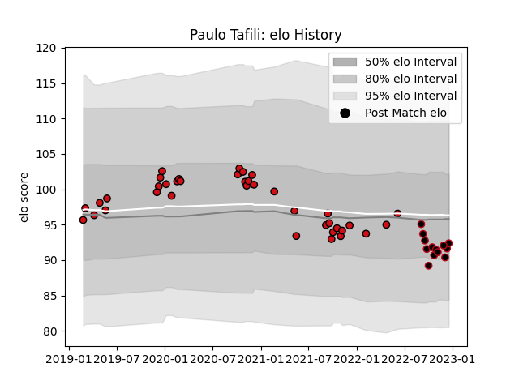

---  
layout: page  
title: Paulo Tafili  
date: 2022-12-09 13:17:03.974798  
categories: player  
---
# Paulo Tafili

## Positions: P

## Current elo: 90.0

## Current Percentile: 21.0

# Elo History

# Match History

| Team             |   Appearances |   Win Rate |
|:-----------------|--------------:|-----------:|
| Stade Toulousain |            38 |   0.618421 |
| Lyon             |            11 |   0.545455 |

| Opponent             |   Matches |   Win Rate |
|:---------------------|----------:|-----------:|
| Montpellier Herault  |         6 |   1        |
| Bayonne              |         5 |   0.4      |
| Toulon               |         5 |   0.4      |
| Perpignan            |         4 |   0.5      |
| Racing 92            |         4 |   0.25     |
| Stade Francais Paris |         4 |   0.5      |
| Bordeaux Begles      |         3 |   0.666667 |
| Castres Olympique    |         3 |   0.833333 |
| Lyon                 |         3 |   0        |
| Agen                 |         2 |   1        |
| Biarritz Olympique   |         2 |   1        |
| Clermont Auvergne    |         2 |   0.5      |
| La Rochelle          |         2 |   0.5      |
| Pau                  |         2 |   1        |
| Brive                |         1 |   1        |
| Stade Toulousain     |         1 |   1        |