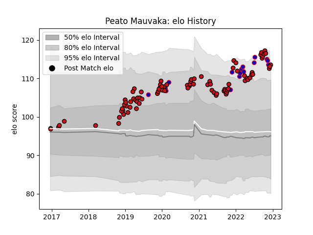

---  
layout: page  
title: Peato Mauvaka  
date: 2022-11-16 11:38:58.259716  
categories: player  
---
# Peato Mauvaka

## Positions: H

## Country: France

## Current elo: 114.0

## Current Percentile: 95.0

# Elo History

# Match History

| Team             |   Appearances |   Win Rate |
|:-----------------|--------------:|-----------:|
| Stade Toulousain |            85 |   0.747059 |
| France           |            15 |   0.933333 |

| Opponent             |   Matches |   Win Rate |
|:---------------------|----------:|-----------:|
| La Rochelle          |         8 |   1        |
| Toulon               |         7 |   0.642857 |
| Clermont Auvergne    |         7 |   0.642857 |
| Bordeaux Begles      |         6 |   0.833333 |
| Castres Olympique    |         6 |   0.416667 |
| Racing 92            |         6 |   0.833333 |
| Pau                  |         5 |   0.8      |
| Montpellier Herault  |         5 |   0.8      |
| Lyon                 |         5 |   0.6      |
| Brive                |         4 |   0.75     |
| Agen                 |         3 |   1        |
| Wasps                |         3 |   0.666667 |
| Scotland             |         3 |   0.666667 |
| Stade Francais Paris |         2 |   0.5      |
| Perpignan            |         2 |   1        |
| Leinster             |         2 |   0        |
| Japan                |         2 |   1        |
| Connacht             |         2 |   1        |
| Biarritz Olympique   |         2 |   1        |
| Grenoble             |         2 |   0.5      |
| Gloucester Rugby     |         2 |   1        |
| England              |         2 |   1        |
| Italy                |         2 |   1        |
| Bayonne              |         2 |   1        |
| Australia            |         1 |   1        |
| Wales                |         1 |   1        |
| Ulster               |         1 |   1        |
| Argentina            |         1 |   1        |
| South Africa         |         1 |   1        |
| Cardiff Blues        |         1 |   1        |
| Exeter Chiefs        |         1 |   0        |
| New Zealand          |         1 |   1        |
| Ireland              |         1 |   1        |
| Zebre                |         1 |   1        |