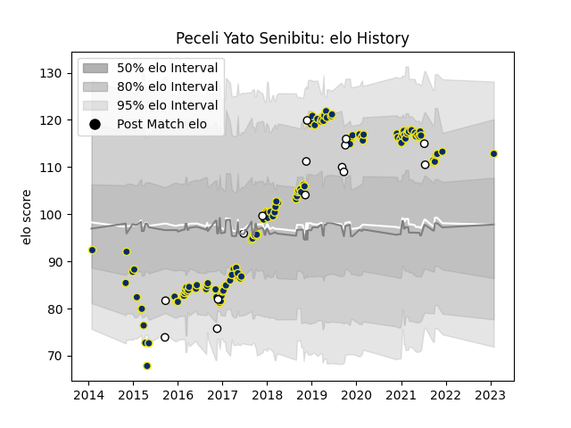

---  
layout: page  
title: Peceli Yato Senibitu  
date: 2023-01-30 11:43:49.427059  
categories: player  
---
# Peceli Yato Senibitu

## Positions: FL, N8

## Country: Fiji

## Current elo: 113.0

## Current Percentile: None

# Elo History

# Match History

| Team              |   Appearances |   Win Rate |
|:------------------|--------------:|-----------:|
| Clermont Auvergne |           126 |   0.646825 |
| Fiji              |            15 |   0.466667 |

| Opponent             |   Matches |   Win Rate |
|:---------------------|----------:|-----------:|
| La Rochelle          |        10 |   0.75     |
| Stade Toulousain     |        10 |   0.15     |
| Bordeaux Begles      |         9 |   0.444444 |
| Racing 92            |         9 |   0.5      |
| Castres Olympique    |         9 |   0.444444 |
| Toulon               |         8 |   0.875    |
| Stade Francais Paris |         8 |   0.8125   |
| Pau                  |         8 |   0.875    |
| Agen                 |         7 |   1        |
| Lyon                 |         6 |   0.333333 |
| Montpellier Herault  |         6 |   0.5      |
| Brive                |         6 |   1        |
| Bayonne              |         5 |   0.4      |
| Grenoble             |         4 |   0.875    |
| Saracens             |         3 |   0.666667 |
| Northampton Saints   |         3 |   1        |
| Ulster               |         3 |   0.333333 |
| Exeter Chiefs        |         2 |   0.5      |
| Australia            |         2 |   0        |
| New Zealand          |         2 |   0        |
| Ospreys              |         2 |   1        |
| Oyonnax              |         2 |   0.5      |
| Perpignan            |         2 |   1        |
| Scotland             |         2 |   0.5      |
| England              |         2 |   0        |
| Tonga                |         1 |   1        |
| Biarritz Olympique   |         1 |   1        |
| Timisoara Saracens   |         1 |   1        |
| Uruguay              |         1 |   1        |
| Georgia              |         1 |   1        |
| Canada               |         1 |   1        |
| Leinster             |         1 |   1        |
| France               |         1 |   1        |
| Japan                |         1 |   1        |
| Harlequins           |         1 |   1        |
| Wales                |         1 |   0        |