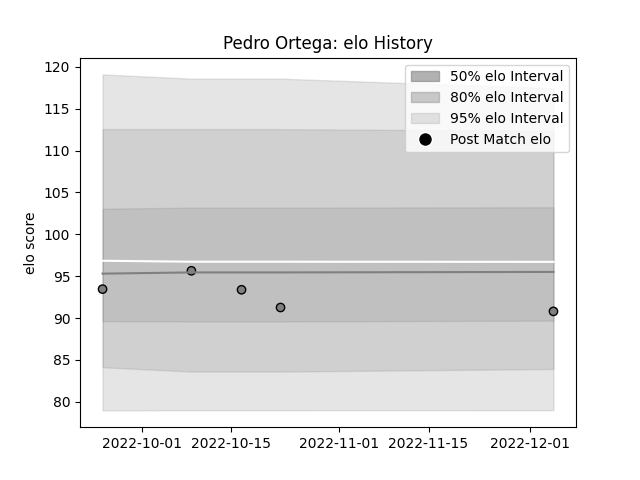

---  
layout: page  
title: Pedro Ortega  
date: 2023-03-21 18:17:38.140712  
categories: player  
---
# Pedro Ortega

Last updated: 2023-03-21
## Positions: L, FL

## Current elo: 83.0

## Current Percentile: 9.0

# Elo History

# Match History

| Team            |   Appearances |   Win Rate |
|:----------------|--------------:|-----------:|
| Rennes          |            10 |   0.2      |
| Lafert San Dona |             9 |   0.388889 |

| Opponent                   |   Matches |   Win Rate |
|:---------------------------|----------:|-----------:|
| Chambery                   |         2 |        0.5 |
| Tarbes                     |         2 |        0   |
| US Bressane                |         2 |        0   |
| Blagnac                    |         1 |        0   |
| Bourgoin-Jallieu           |         1 |        0   |
| Cognac Saint Jean d'Angély |         1 |        1   |
| Femi CZ Rugby Rovigo       |         1 |        0   |
| Fiamme Oro Roma            |         1 |        0   |
| Kawasaki Robot Calvisano   |         1 |        0   |
| Lazio Rugby                |         1 |        0   |
| Mogliano Rugby 1969        |         1 |        0   |
| Nice                       |         1 |        0   |
| Rugby Colorno 1975         |         1 |        1   |
| Rugby Lyons Piacenza       |         1 |        1   |
| Rugby Viadana 1970         |         1 |        0.5 |
| Valorugby Emilia           |         1 |        1   |