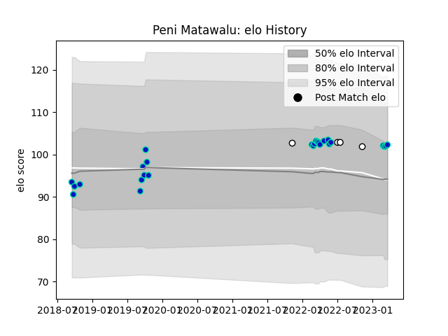

---  
layout: page  
title: Peni Matawalu  
date: 2023-03-02 11:22:34.300952  
categories: player  
---
# Peni Matawalu

## Positions: SH

## Country: Fiji

## Current elo: 102.0

## Current Percentile: 72.0

# Elo History

# Match History

| Team        |   Appearances |   Win Rate |
|:------------|--------------:|-----------:|
| Fijian Drua |            23 |   0.413043 |
| Fiji        |             4 |   0.5      |

| Opponent                 |   Matches |   Win Rate |
|:-------------------------|----------:|-----------:|
| Queensland Country       |         3 |   0.666667 |
| New South Wales Waratahs |         2 |   0        |
| Moana Pasifika           |         2 |   1        |
| Sydney Rays              |         2 |   1        |
| NSW Country Eagles       |         2 |   0.75     |
| Western Force            |         2 |   0        |
| Melbourne Rebels         |         2 |   0.5      |
| Canberra Vikings         |         2 |   0        |
| Melbourne Rising         |         1 |   1        |
| Crusaders                |         1 |   0        |
| Brumbies                 |         1 |   0        |
| Chiefs                   |         1 |   0        |
| Queensland Reds          |         1 |   0        |
| Samoa                    |         1 |   0        |
| Scotland                 |         1 |   0        |
| Spain                    |         1 |   1        |
| Tonga                    |         1 |   1        |
| Blues                    |         1 |   0        |