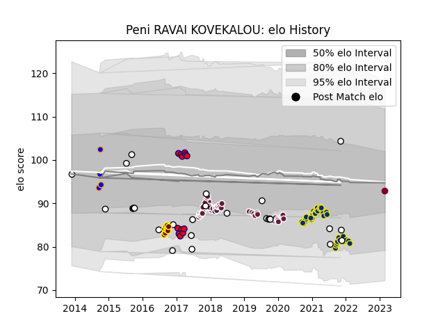

---  
layout: page  
title: Peni RAVAI KOVEKALOU  
date: 2023-03-21 18:06:42.911666  
categories: player  
---
# Peni RAVAI KOVEKALOU

Last updated: 2023-03-21
## Positions: P

## Country: Fiji

## Current elo: 81.0

## Current Percentile: None

# Elo History

# Match History

| Team                |   Appearances |   Win Rate |
|:--------------------|--------------:|-----------:|
| Bordeaux Begles     |            46 |   0.543478 |
| Clermont Auvergne   |            37 |   0.472973 |
| Fiji                |            27 |   0.425926 |
| Aurillac            |            12 |   0.333333 |
| Southland           |             9 |   0.222222 |
| Greater Sydney Rams |             4 |   0.375    |
| Queensland Reds     |             3 |   0.666667 |

| Opponent                 |   Matches |   Win Rate |
|:-------------------------|----------:|-----------:|
| Racing 92                |         8 |   0.25     |
| Stade Toulousain         |         6 |   0.166667 |
| Pau                      |         6 |   0.666667 |
| La Rochelle              |         6 |   0.666667 |
| Lyon                     |         5 |   0.4      |
| Castres Olympique        |         5 |   0.2      |
| Brive                    |         5 |   0.5      |
| Bordeaux Begles          |         4 |   0.125    |
| Montpellier Herault      |         4 |   0.5      |
| Toulon                   |         4 |   0.25     |
| Stade Francais Paris     |         4 |   0.75     |
| Wales                    |         3 |   0        |
| Georgia                  |         3 |   0.5      |
| Bayonne                  |         3 |   0.666667 |
| Clermont Auvergne        |         3 |   0.666667 |
| Wasps                    |         3 |   1        |
| Australia                |         3 |   0        |
| Oyonnax                  |         3 |   0.333333 |
| Agen                     |         3 |   1        |
| New Zealand Maori        |         2 |   0.5      |
| New Zealand              |         2 |   0        |
| RC Enisei                |         2 |   1        |
| Italy                    |         2 |   0.5      |
| Enisey-STM Krasnoyarsk   |         2 |   1        |
| Tonga                    |         2 |   0.5      |
| England                  |         2 |   0        |
| Edinburgh                |         2 |   0.75     |
| Dragons                  |         2 |   0.5      |
| Ulster                   |         1 |   0        |
| Wellington               |         1 |   0        |
| Vannes                   |         1 |   0        |
| Uruguay                  |         1 |   1        |
| United States of America |         1 |   1        |
| Perpignan                |         1 |   0        |
| Northland                |         1 |   1        |
| Queensland Country       |         1 |   0        |
| Spain                    |         1 |   1        |
| Taranaki                 |         1 |   0        |
| Romania                  |         1 |   1        |
| Scotland                 |         1 |   1        |
| Soyaux-Angouleme         |         1 |   1        |
| Otago                    |         1 |   0        |
| Mont-de-Marsan           |         1 |   0        |
| North Harbour Rays       |         1 |   0.5      |
| North Harbour            |         1 |   0        |
| Auckland                 |         1 |   0        |
| Bay of Plenty            |         1 |   1        |
| Beziers                  |         1 |   0        |
| Biarritz Olympique       |         1 |   1        |
| Bourgoin-Jallieu         |         1 |   1        |
| Brisbane City            |         1 |   1        |
| Brumbies                 |         1 |   0        |
| Canada                   |         1 |   1        |
| Carcassonne              |         1 |   1        |
| Colomiers                |         1 |   0        |
| Fijian Drua              |         1 |   1        |
| Grenoble                 |         1 |   1        |
| Hawke's Bay              |         1 |   0        |
| Ireland                  |         1 |   0        |
| Japan                    |         1 |   1        |
| Manawatu                 |         1 |   0        |
| Melbourne Rising         |         1 |   0        |
| Albi                     |         1 |   1        |
| Montauban                |         1 |   0        |
| Munster                  |         1 |   0        |
| Narbonne                 |         1 |   0        |
| Western Force            |         1 |   1        |