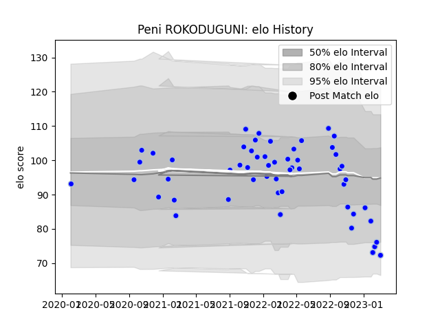

---  
layout: page  
title: Peni ROKODUGUNI  
date: 2023-03-09 10:10:06.519630  
categories: player  
---
# Peni ROKODUGUNI

## Positions: W

## Current elo: 72.0

## Current Percentile: 8.0

# Elo History

# Match History

| Team      |   Appearances |   Win Rate |
|:----------|--------------:|-----------:|
| Colomiers |            54 |   0.574074 |

| Opponent           |   Matches |   Win Rate |
|:-------------------|----------:|-----------:|
| Beziers            |         5 |   0.8      |
| Nevers             |         4 |   0.75     |
| Provence Rugby     |         4 |   0.75     |
| Carcassonne        |         4 |   0.5      |
| Grenoble           |         4 |   0.75     |
| Oyonnax            |         4 |   0.5      |
| Montauban          |         4 |   0        |
| Agen               |         3 |   0.666667 |
| Soyaux-Angouleme   |         3 |   1        |
| Vannes             |         3 |   0.333333 |
| Mont-de-Marsan     |         3 |   0.333333 |
| Aurillac           |         2 |   0.5      |
| Biarritz Olympique |         2 |   0        |
| Rouen              |         2 |   1        |
| US Bressane        |         2 |   0.5      |
| Narbonne           |         2 |   1        |
| Perpignan          |         1 |   0        |
| Roval Drome XV     |         1 |   1        |
| Bayonne            |         1 |   0        |