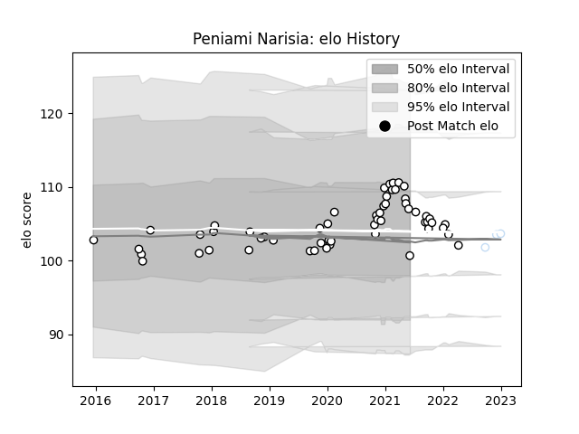

---  
layout: page  
title: Peniami Narisia  
date: 2022-12-09 13:23:12.883757  
categories: player  
---
# Peniami Narisia

## Positions: H, FL

## Country: Fiji

## Current elo: 100.0

## Current Percentile: 67.0

# Elo History

# Match History

| Team      |   Appearances |   Win Rate |
|:----------|--------------:|-----------:|
| Brive     |            49 |   0.387755 |
| Racing 92 |             2 |   0.5      |
| Fiji      |             1 |   0        |

| Opponent             |   Matches |   Win Rate |
|:---------------------|----------:|-----------:|
| Toulon               |         5 |   0.4      |
| Stade Francais Paris |         5 |   0.6      |
| Montpellier Herault  |         5 |   0.2      |
| Pau                  |         4 |   0.75     |
| Worcester Warriors   |         3 |   0.666667 |
| Racing 92            |         3 |   0        |
| Lyon                 |         2 |   0.5      |
| Stade Toulousain     |         2 |   0        |
| RC Enisei            |         2 |   0.5      |
| Oyonnax              |         2 |   1        |
| Agen                 |         2 |   1        |
| La Rochelle          |         2 |   0.5      |
| Clermont Auvergne    |         2 |   0        |
| Castres Olympique    |         2 |   0.5      |
| Bristol Rugby        |         2 |   0        |
| Bordeaux Begles      |         2 |   0.5      |
| Bayonne              |         1 |   0        |
| New Zealand          |         1 |   0        |
| Dragons              |         1 |   0        |
| Connacht             |         1 |   0        |
| Saracens             |         1 |   0        |
| Biarritz Olympique   |         1 |   0        |
| Mont-de-Marsan       |         1 |   0        |