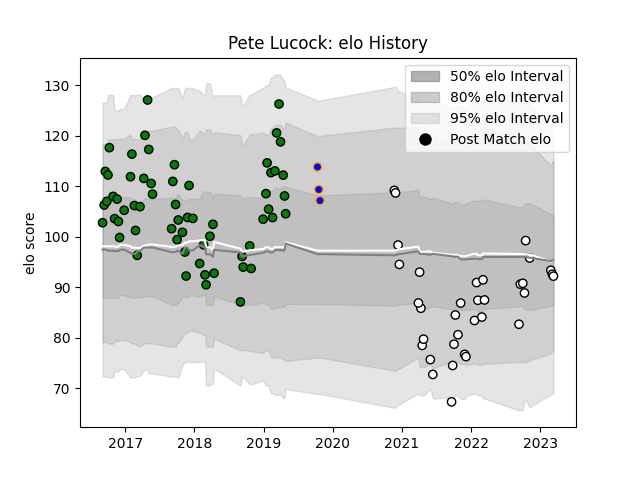

---  
layout: page  
title: Pete Lucock  
date: 2023-01-17 11:32:45.139584  
categories: player  
---
# Pete Lucock

## Positions: C, FH

## Current elo: 77.0

## Current Percentile: 17.0

# Elo History

# Match History

| Team               |   Appearances |   Win Rate |
|:-------------------|--------------:|-----------:|
| Yorkshire Carnegie |            57 |   0.640351 |
| Newcastle Falcons  |            29 |   0.258621 |
| Doncaster          |             3 |   0.333333 |

| Opponent            |   Matches |   Win Rate |
|:--------------------|----------:|-----------:|
| Cornish Pirates     |         7 |   0.428571 |
| Jersey              |         6 |   0.5      |
| Hartpury College    |         5 |   0.7      |
| Bristol Rugby       |         5 |   0.2      |
| Richmond            |         5 |   0.8      |
| Nottingham          |         5 |   1        |
| Doncaster           |         5 |   0.8      |
| Ealing Trailfinders |         5 |   0.4      |
| London Scottish     |         5 |   0.6      |
| Bedford             |         5 |   0.8      |
| Rotherham Titans    |         4 |   0.75     |
| London Irish        |         4 |   0.25     |
| Bath Rugby          |         4 |   0.5      |
| Harlequins          |         4 |   0        |
| Gloucester Rugby    |         3 |   0        |
| Saracens            |         3 |   0        |
| Leicester Tigers    |         2 |   0        |
| Exeter Chiefs       |         2 |   0.5      |
| Coventry            |         2 |   0.5      |
| Cardiff Blues       |         2 |   0        |
| London Welsh        |         1 |   1        |
| Northampton Saints  |         1 |   0        |
| Castres Olympique   |         1 |   1        |
| Sale Sharks         |         1 |   1        |
| Wasps               |         1 |   1        |
| Worcester Warriors  |         1 |   0.5      |