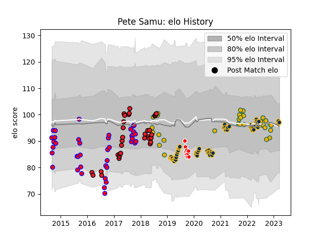

---  
layout: page  
title: Pete Samu  
date: 2023-02-24 09:45:55.413910  
categories: player  
---
# Pete Samu

## Positions: N8, FL

## Country: Australia

## Current elo: 94.0

## Current Percentile: 48.0

# Elo History

# Match History

| Team             |   Appearances |   Win Rate |
|:-----------------|--------------:|-----------:|
| Brumbies         |            55 |   0.709091 |
| Tasman           |            40 |   0.6125   |
| Crusaders        |            33 |   0.969697 |
| Australia        |            32 |   0.390625 |
| Canberra Vikings |             9 |   0.666667 |

| Opponent                 |   Matches |   Win Rate |
|:-------------------------|----------:|-----------:|
| Queensland Reds          |        11 |  0.545455  |
| Melbourne Rebels         |        10 |  0.7       |
| New South Wales Waratahs |        10 |  1         |
| Western Force            |        10 |  0.8       |
| Hurricanes               |         7 |  0.714286  |
| Blues                    |         7 |  0.714286  |
| Chiefs                   |         7 |  1         |
| Argentina                |         6 |  0.666667  |
| New Zealand              |         6 |  0.0833333 |
| Canterbury               |         6 |  0.166667  |
| Taranaki                 |         6 |  0.5       |
| Sunwolves                |         5 |  1         |
| South Africa             |         5 |  0.8       |
| England                  |         5 |  0.2       |
| Auckland                 |         4 |  0.375     |
| Counties Manukau         |         4 |  0.25      |
| Waikato                  |         4 |  1         |
| Otago                    |         4 |  0.75      |
| Ireland                  |         4 |  0.25      |
| Southland                |         3 |  1         |
| Stormers                 |         3 |  1         |
| Wellington               |         3 |  1         |
| Fijian Drua              |         3 |  1         |
| Lions                    |         3 |  1         |
| Highlanders              |         3 |  0.666667  |
| Manawatu                 |         2 |  0.5       |
| Brumbies                 |         2 |  1         |
| Crusaders                |         2 |  0         |
| Bulls                    |         2 |  1         |
| Jaguares                 |         2 |  0.5       |
| Sharks                   |         2 |  1         |
| Italy                    |         2 |  0.5       |
| Wales                    |         1 |  0         |
| Sydney Rays              |         1 |  1         |
| Southern Kings           |         1 |  1         |
| Brisbane City            |         1 |  1         |
| Scotland                 |         1 |  0         |
| Bay of Plenty            |         1 |  1         |
| Queensland Country       |         1 |  0         |
| Northland                |         1 |  1         |
| North Harbour            |         1 |  1         |
| NSW Country Eagles       |         1 |  1         |
| Melbourne Rising         |         1 |  1         |
| Japan                    |         1 |  1         |
| Hawke's Bay              |         1 |  1         |
| France                   |         1 |  0         |
| Cheetahs                 |         1 |  1         |
| Moana Pasifika           |         1 |  0         |