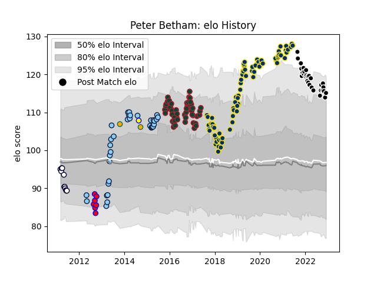

---  
layout: page  
title: Peter Betham  
date: 2023-02-04 17:24:52.304507  
categories: player  
---
# Peter Betham

## Positions: W, C

## Country: Australia

## Current elo: 92.0

## Current Percentile: 93.0

# Elo History

# Match History

| Team                     |   Appearances |   Win Rate |
|:-------------------------|--------------:|-----------:|
| Clermont Auvergne        |            84 |   0.654762 |
| Leicester Tigers         |            55 |   0.581818 |
| Provence Rugby           |            35 |   0.628571 |
| New South Wales Waratahs |            34 |   0.617647 |
| Melbourne Rebels         |            11 |   0.181818 |
| Tasman                   |            11 |   0.454545 |
| Australia                |             2 |   0.5      |
| Sydney Stars             |             1 |   0        |

| Opponent                 |   Matches |   Win Rate |
|:-------------------------|----------:|-----------:|
| Stade Francais Paris     |         9 |   0.777778 |
| Agen                     |         8 |   0.625    |
| Racing 92                |         8 |   0.4375   |
| Northampton Saints       |         8 |   0.875    |
| Harlequins               |         7 |   0.857143 |
| Saracens                 |         7 |   0.428571 |
| La Rochelle              |         6 |   0.666667 |
| Brumbies                 |         6 |   0.5      |
| Queensland Reds          |         6 |   0.5      |
| Stade Toulousain         |         6 |   0.416667 |
| Bordeaux Begles          |         5 |   0.4      |
| Exeter Chiefs            |         5 |   0.4      |
| Pau                      |         5 |   0.6      |
| Oyonnax                  |         5 |   0.4      |
| Lyon                     |         5 |   0.8      |
| Wasps                    |         5 |   0.2      |
| Western Force            |         5 |   0.8      |
| Grenoble                 |         5 |   0.9      |
| Sale Sharks              |         4 |   0.25     |
| Stormers                 |         4 |   0.5      |
| Montpellier Herault      |         4 |   0        |
| Mont-de-Marsan           |         4 |   0.75     |
| Melbourne Rebels         |         4 |   0.75     |
| Worcester Warriors       |         4 |   1        |
| Bath Rugby               |         4 |   0.75     |
| Bayonne                  |         4 |   0.75     |
| Castres Olympique        |         4 |   0.5      |
| Dragons                  |         3 |   1        |
| Cheetahs                 |         3 |   0.333333 |
| Toulon                   |         3 |   0.333333 |
| Brive                    |         3 |   0.666667 |
| Newcastle Falcons        |         3 |   0.666667 |
| Munster                  |         3 |   0.666667 |
| Montauban                |         3 |   1        |
| Gloucester Rugby         |         3 |   1        |
| Colomiers                |         3 |   0.333333 |
| Hurricanes               |         3 |   0.666667 |
| Crusaders                |         3 |   0.333333 |
| Otago                    |         2 |   0        |
| Ospreys                  |         2 |   1        |
| Blues                    |         2 |   1        |
| Rouen                    |         2 |   0.5      |
| Chiefs                   |         2 |   0.5      |
| Perpignan                |         2 |   1        |
| Highlanders              |         2 |   0        |
| Bulls                    |         2 |   0        |
| Glasgow Warriors         |         2 |   0        |
| Timisoara Saracens       |         2 |   1        |
| US Bressane              |         2 |   0.75     |
| Vannes                   |         2 |   0.5      |
| Nevers                   |         2 |   0.5      |
| Carcassonne              |         2 |   1        |
| Aurillac                 |         2 |   0.5      |
| Benetton Treviso         |         2 |   1        |
| Soyaux-Angouleme         |         1 |   1        |
| Ulster                   |         1 |   0        |
| Taranaki                 |         1 |   0        |
| Waikato                  |         1 |   0        |
| Bay of Plenty            |         1 |   1        |
| Counties Manukau         |         1 |   1        |
| Manawatu                 |         1 |   1        |
| Southland                |         1 |   1        |
| Southern Kings           |         1 |   1        |
| Sharks                   |         1 |   0        |
| Beziers                  |         1 |   1        |
| Bristol Rugby            |         1 |   1        |
| Northland                |         1 |   0        |
| Canterbury               |         1 |   1        |
| North Harbour            |         1 |   0        |
| New Zealand              |         1 |   0        |
| New South Wales Waratahs |         1 |   0        |
| Narbonne                 |         1 |   0        |
| Argentina                |         1 |   1        |
| London Irish             |         1 |   1        |
| Brisbane City            |         1 |   0        |