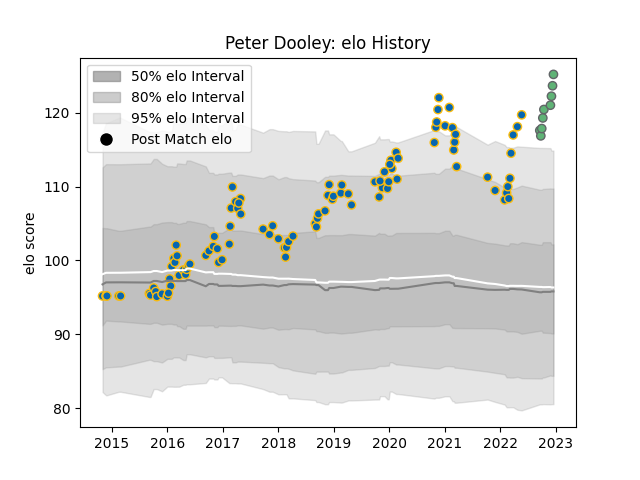

---  
layout: page  
title: Peter Dooley  
date: 2023-01-06 00:22:01.371666  
categories: player  
---
# Peter Dooley

## Positions: P

## Current elo: 130.0

## Current Percentile: 99.0

# Elo History

# Match History

| Team     |   Appearances |   Win Rate |
|:---------|--------------:|-----------:|
| Leinster |           100 |   0.74     |
| Connacht |            11 |   0.363636 |

| Opponent          |   Matches |   Win Rate |
|:------------------|----------:|-----------:|
| Dragons           |        10 |   0.8      |
| Ulster            |        10 |   0.4      |
| Ospreys           |        10 |   0.85     |
| Connacht          |         9 |   0.777778 |
| Glasgow Warriors  |         9 |   0.666667 |
| Benetton Treviso  |         9 |   0.888889 |
| Zebre             |         9 |   1        |
| Edinburgh         |         8 |   0.75     |
| Cardiff Blues     |         7 |   0.857143 |
| Scarlets          |         7 |   0.5      |
| Munster           |         6 |   0.5      |
| Southern Kings    |         3 |   1        |
| Cheetahs          |         2 |   0.5      |
| Leinster          |         2 |   0        |
| Wasps             |         1 |   0        |
| Stormers          |         1 |   0        |
| Sharks            |         1 |   0        |
| Bath Rugby        |         1 |   1        |
| Newcastle Falcons |         1 |   1        |
| Lyon              |         1 |   1        |
| Clermont Auvergne |         1 |   0        |
| Bulls             |         1 |   0        |
| Brive             |         1 |   1        |
| Lions             |         1 |   1        |