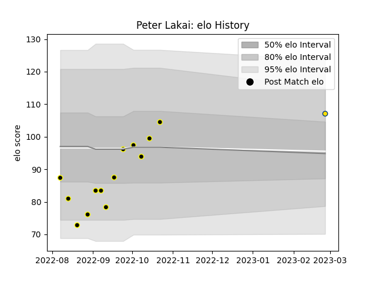

---  
layout: page  
title: Peter Lakai  
date: 2023-03-02 11:27:22.170568  
categories: player  
---
# Peter Lakai

## Positions: N8

## Current elo: 107.0

## Current Percentile: 74.0

# Elo History

# Match History

| Team       |   Appearances |   Win Rate |
|:-----------|--------------:|-----------:|
| Wellington |            13 |   0.846154 |
| Hurricanes |             1 |   1        |

| Opponent         |   Matches |   Win Rate |
|:-----------------|----------:|-----------:|
| Canterbury       |         2 |        0.5 |
| Hawke's Bay      |         2 |        1   |
| Auckland         |         1 |        1   |
| Bay of Plenty    |         1 |        1   |
| Counties Manukau |         1 |        1   |
| Northland        |         1 |        0   |
| Otago            |         1 |        1   |
| Queensland Reds  |         1 |        1   |
| Southland        |         1 |        1   |
| Taranaki         |         1 |        1   |
| Tasman           |         1 |        1   |
| Waikato          |         1 |        1   |