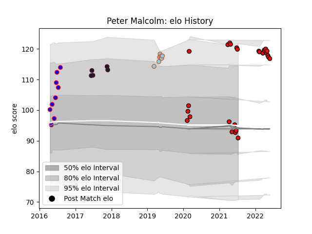

---  
layout: page  
title: Peter Malcolm  
date: 2023-02-28 11:06:33.525642  
categories: player  
---
# Peter Malcolm

## Positions: H

## Country: United States of America

## Current elo: 91.0

## Current Percentile: 94.0

# Elo History

# Match History

| Team                     |   Appearances |   Win Rate |
|:-------------------------|--------------:|-----------:|
| San Diego Legion         |            27 |   0.518519 |
| Ohio                     |             9 |   0.777778 |
| Austin Elite Rugby       |             8 |   0        |
| United States of America |             5 |   0.3      |

| Opponent               |   Matches |   Win Rate |
|:-----------------------|----------:|-----------:|
| Utah Warriors          |         5 |   0.6      |
| Seattle Seawolves      |         5 |   0.4      |
| L. A. Giltinis         |         4 |   0.25     |
| Austin Gilgronis       |         4 |   0.25     |
| Denver                 |         3 |   0.666667 |
| San Francisco          |         3 |   0.666667 |
| Houston SaberCats      |         3 |   0        |
| Georgia                |         2 |   0        |
| Toronto Arrows         |         2 |   0.5      |
| Sacramento             |         2 |   1        |
| R.U. New York          |         2 |   0.5      |
| NOLA Gold              |         2 |   0.5      |
| Dallas Jackals         |         2 |   1        |
| New England Free Jacks |         1 |   1        |
| Canada                 |         1 |   0.5      |
| Rugby ATL              |         1 |   0        |
| Rugby New York         |         1 |   0        |
| Ireland                |         1 |   0        |
| San Diego              |         1 |   1        |
| Glendale Raptors       |         1 |   0        |
| Colorado Raptors       |         1 |   1        |
| Germany                |         1 |   1        |
| Old Glory DC           |         1 |   0        |