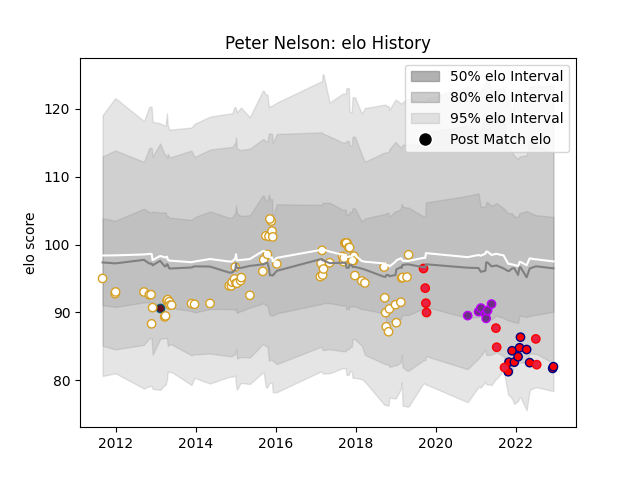

---  
layout: page  
title: Peter Nelson  
date: 2022-12-18 16:16:23.147808  
categories: player  
---
# Peter Nelson

## Positions: FH, FB

## Country: Canada

## Current elo: 82.0

## Current Percentile: 9.0

# Elo History

# Match History

| Team        |   Appearances |   Win Rate |
|:------------|--------------:|-----------:|
| Ulster      |            73 |   0.705479 |
| Aurillac    |            12 |   0.583333 |
| Canada      |             9 |   0.111111 |
| US Bressane |             7 |   1        |
| Munster     |             1 |   1        |

| Opponent                 |   Matches |   Win Rate |
|:-------------------------|----------:|-----------:|
| Leinster                 |         9 |   0.333333 |
| Edinburgh                |         9 |   0.777778 |
| Benetton Treviso         |         8 |   1        |
| Dragons                  |         7 |   0.928571 |
| Munster                  |         7 |   0.5      |
| Connacht                 |         6 |   0.5      |
| Zebre                    |         6 |   0.833333 |
| Scarlets                 |         5 |   0.6      |
| Ospreys                  |         4 |   0.75     |
| Vannes                   |         2 |   0.5      |
| Rouen                    |         2 |   1        |
| Southern Kings           |         2 |   1        |
| Harlequins               |         2 |   1        |
| Cheetahs                 |         2 |   0.75     |
| United States of America |         2 |   0        |
| Cardiff Blues            |         2 |   0.5      |
| Colomiers                |         2 |   1        |
| Glasgow Warriors         |         2 |   1        |
| Spain                    |         1 |   0        |
| Provence Rugby           |         1 |   1        |
| Tarbes                   |         1 |   1        |
| US Bressane              |         1 |   0        |
| Wales                    |         1 |   0        |
| South Africa             |         1 |   0        |
| Wasps                    |         1 |   1        |
| Saracens                 |         1 |   0        |
| Agen                     |         1 |   0        |
| Oyonnax                  |         1 |   1        |
| New Zealand              |         1 |   0        |
| Narbonne                 |         1 |   1        |
| Montauban                |         1 |   0        |
| Aubenas                  |         1 |   1        |
| Italy                    |         1 |   0        |
| England                  |         1 |   0        |
| Dijon                    |         1 |   1        |
| Dax                      |         1 |   1        |
| Chambery                 |         1 |   1        |
| Bourgoin-Jallieu         |         1 |   1        |
| Beziers                  |         1 |   1        |
| Belgium                  |         1 |   1        |
| Mont-de-Marsan           |         1 |   0        |