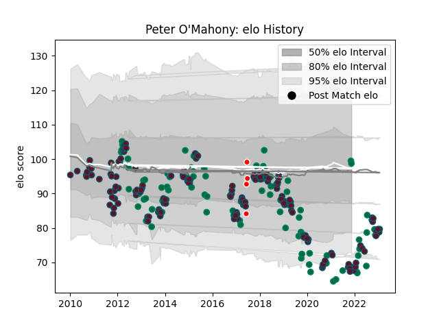

---  
layout: page  
title: Peter O'Mahony  
date: 2022-12-14 11:29:41.741229  
categories: player  
---
# Peter O'Mahony

## Positions: FL

## Country: Ireland

## Current elo: 84.0

## Current Percentile: 12.0

# Elo History

# Match History

| Team                    |   Appearances |   Win Rate |
|:------------------------|--------------:|-----------:|
| Munster                 |           156 |   0.682692 |
| Ireland                 |            82 |   0.670732 |
| British and Irish Lions |             4 |   0.5      |

| Opponent                 |   Matches |   Win Rate |
|:-------------------------|----------:|-----------:|
| Leinster                 |        17 |   0.176471 |
| Ulster                   |        13 |   0.576923 |
| Wales                    |        12 |   0.5      |
| Connacht                 |        12 |   0.75     |
| England                  |        12 |   0.416667 |
| Ospreys                  |        11 |   0.636364 |
| Edinburgh                |        10 |   0.9      |
| France                   |        10 |   0.7      |
| New Zealand              |         9 |   0.333333 |
| Glasgow Warriors         |         9 |   0.888889 |
| Scotland                 |         9 |   0.888889 |
| Racing 92                |         9 |   0.5      |
| Castres Olympique        |         8 |   0.8125   |
| Italy                    |         8 |   0.875    |
| Scarlets                 |         7 |   0.785714 |
| Saracens                 |         7 |   0.428571 |
| Australia                |         7 |   0.714286 |
| Cardiff Blues            |         6 |   0.833333 |
| Benetton Treviso         |         6 |   0.833333 |
| Zebre                    |         5 |   1        |
| South Africa             |         4 |   0.75     |
| Leicester Tigers         |         4 |   0.75     |
| Gloucester Rugby         |         4 |   1        |
| Dragons                  |         4 |   0.5      |
| Stade Toulousain         |         3 |   0.666667 |
| Canada                   |         3 |   1        |
| Clermont Auvergne        |         3 |   0        |
| Argentina                |         3 |   1        |
| Japan                    |         2 |   0.5      |
| Sale Sharks              |         2 |   1        |
| Wasps                    |         2 |   1        |
| Samoa                    |         2 |   1        |
| Aironi                   |         2 |   1        |
| Perpignan                |         2 |   1        |
| Exeter Chiefs            |         2 |   0.75     |
| Northampton Saints       |         2 |   1        |
| Russia                   |         1 |   1        |
| Cheetahs                 |         1 |   1        |
| Sharks                   |         1 |   1        |
| New Zealand Maori        |         1 |   1        |
| Stormers                 |         1 |   1        |
| Toulon                   |         1 |   1        |
| Bulls                    |         1 |   1        |
| United States of America |         1 |   1        |
| Blues                    |         1 |   0        |
| Harlequins               |         1 |   1        |
| Crusaders                |         1 |   1        |